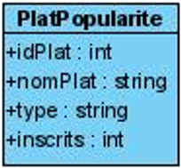
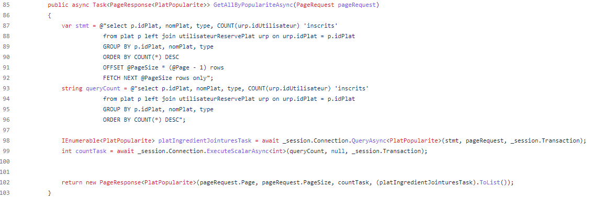
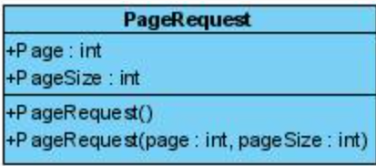
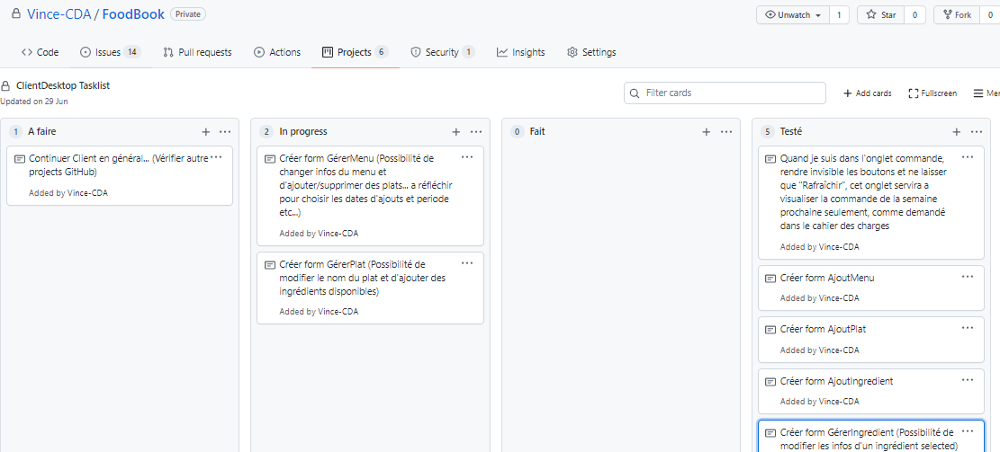
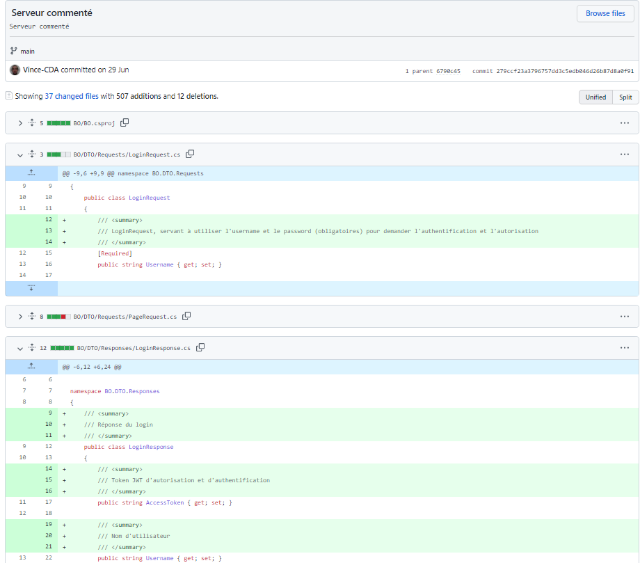
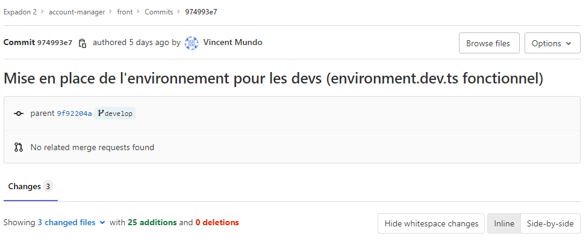

## Développer des composants métier 
### Qu’est-ce que des composants métier ?
Les **composants métiers** sont tous les composants touchant la **couche métier**. Par exemple, la **B**usiness **O**bject, les **objets métiers**, sont des **composants**, ils sont utilisés dans le projet par rapport à la conception que l’on fait en équipe ou seul après avoir fait un diagramme de cas d’utilisations.

Par exemple, pour un restaurant, je pourrai avoir un composant « Utilisateur » avec les propriétés qu’il faut pour respecter un cahier des charges.

Il y aura donc son identifiant technique, son prénom, son nom ainsi que toutes les données utiles pour l’application.

Bien entendu, il peut y avoir les plats, ingrédients et même les réservations qui peuvent être des composants métiers.

Il est pratique d’ajouter un **ORM\*** ou un **micro-ORM\*\*** pour faire le **mapping** (le lien) entre le **langage** de programmation de l’application voulu et la **base de données**. Il va de ce fait pouvoir faire le **lien** automatiquement, si la **syntaxe** des noms de classes et des noms de colonnes dans les tables de la base de données **est la même** (Avec ou sans le **respect de la casse** si nous **paramétrons** bien **l’ORM**).

\*Un **mapping objet-relationnel** (en anglais **o**bject-**r**elational **m**apping ou **ORM**) est un **type de programme informatique** qui se place en **interface** entre un **programme applicatif** et une **base de données relationnelle** **pour simuler une base de données orientée objet**. Ce programme définit des correspondances entre les schémas de la base de données et les classes du programme applicatif. On pourrait le désigner par-là, « **comme une couche d'abstraction entre le monde objet et monde relationnel** ». Du fait de sa fonction, on retrouve ce type de programme dans un grand nombre de frameworks sous la forme de composant ORM qui a été soit développé, soit intégré depuis une solution externe.
ils sont souvent **complexes** **: il faut beaucoup de temps pour vraiment les maîtriser et comprendre toutes leurs subtilités** ;

1. Ils **manquent de transparence** : il n'est pas toujours évident de savoir ce qu'il se passe en coulisses, quelles requêtes sont effectivement exécutées sur la base de données, quelles données sont conservées en cache, dans quels cas le chargement tardif (lazy loading) s'applique, etc. Quand un **bug lié à l'ORM se produit, il est parfois difficile de trouver son origine** ;
1. Leurs **performances sont médiocres**, **comparées** à celles qu'on peut obtenir **en requêtant** **directement la base en SQL**.

\*\* Le micro-ORM est très léger, il permet de requêter une base de données en SQL, mais sans les inconvénients associés à cette approche quand on utilise ADO.NET (Driver SQL) :

1. Pas besoin de manipuler les objets IDbCommand, IDbDataParameter, IDataReader, etc. ;
1. La **matérialisation des entités est automatique** : on spécifie simplement le type des entités via un paramètre générique de la méthode qui effectue la requête ;
1. Le passage des paramètres d'une requête se fait de façon très simple, en passant un objet dont les **noms des propriétés correspondent aux noms des paramètres** (cet objet peut éventuellement être d'un type anonyme).

*Légende 1 Entité de la BO : Plat, avec propriétés et constructeurs ainsi que deux méthodes*

*Légende 2 Entité de la BO : Utilisateur, avec propriétés et constructeurs ainsi que deux méthodes*

Voici des **exemples de diagramme de classe d’objets métiers** utilisés dans le cadre du **projet fil rouge** n°2 qui m’a été confié en vue de passer une évaluation professionnelle en cours de formation que j’ai obtenu avec succès.

Il existe aussi des DTO pouvant servir de transférer des objets ou d’y inclure des propriétés qui ne sont pas présentent dans la base de données. Ce sont les Data Transfert Object. 

Imaginons que je veuille faire une requête me rapportant le nombre d’inscription par plats présents dans une base de données. L’entité « Plat » ne suffirait pas et je n’aurai peut-être pas besoin de toutes ses propriétés. C’est pour cela que je peux créer un DTO qui aurait cette forme :

*Légende 3 DTO : PlatPopularite pour la popularité d'un plat*

Dans ce cas « **inscrits** » y est ajouté et me servira dans la **couche d’accès aux données** (DAL) comme un « **COUNT** » dans une **requête** **SQL** servant à **compter** le **nombre d’inscrits** à un **plat**.

Voici la **requête SQL** pour apporter de la **technique** à la **théorie** :

Nous constatons que « **inscrits** » est un **alias** de « **COUNT(idUtilisateur)** » et va pouvoir, grâce à cette requête de la **ligne 87** à la **ligne 92**, **retourner** les **plats par popularité**.

Maintenant intéressons-nous au « **PageSize** » et au « **Page** » ainsi qu’au « **QueryCount** ».

J’exécute deux requêtes, une requête qui va me renvoyer des informations de la base de données et une autre qui va me renvoyer le nombre de ligne de la réponse.

Dans la première requête « **stmt** », j’utilise une fonction « **OFFSET et FETCH NEXT** » en fonction de la taille de la page et du numéro de page que j’aurai inséré dans le **DTO** que je vous montre plus loin. De ce fait, via cette **taille de page indiquée**, la requête me renverra **seulement** les **résultats** de la page que je veux **parmi une taille de page définie**. Ainsi, la « **pagination** » est mise en place et fonctionne, me permettant de **ne pas saturer une base de données** qui contiendrait énormément de données.

*Légende 4 DTO : **PageRequest** avec **Page** et **PageSize** permettant une **pagination** quand il est en **requête***

Il existe donc des **DTO** pouvant servir de « **vue** » comme avec des **tables SQL** et d’autres pouvant servir **d’outils** pour gérer les **requêtes** et **fonctionnalités** du type de **réponse** ou de **requête**.
## Préparer et exécuter les plans de tests d’une application 
## Concevoir une application 
## Développer une application mobile 
## Préparer et exécuter le déploiement d’une application 
## Construire une application organisée en couches 
### Système Multicouche
Comme son nom l'indique, un **système** **multicouche** est un système composé de **plusieurs couches**. Chaque **couche** possède une **fonctionnalité** et une **responsabilité** **spécifiques**. Prenons l'exemple d'un cadre Modèle-vue-contrôleur : chaque couche possède ses propres responsabilités. Les **modèles** contiennent la manière dont les **données doivent être formées**, le **contrôleur** se concentre sur les **actions entrantes** et la **vue** sur les **actions sortantes**. **Chaque couche** est **dissociée**, mais **interagit** avec les **autres**. Dans le style d'architecture **API REST**, le même principe s'applique. Les **différentes couches** de l'architecture **travaillent ensemble** pour construire une **hiérarchie** qui favorise la création d'une **application** plus **évolutive** et **modulaire**.

Un **système** **multicouche** permet également **d'encapsuler** les **systèmes legacy\*** et de **déplacer les fonctionnalités** les moins couramment utilisées vers **un intermédiaire partagé**, tout en **protégeant** **les composants plus modernes et couramment utilisés**. De plus, le **système multicouche** vous permet de **déplacer librement des systèmes à l'intérieur et à l'extérieur de l’architecture** à mesure que les **technologies** et les **services** **évoluent**, augmentant ainsi la **flexibilité** et la **longévité**, à condition que **les différents modules** restent **associés** de la manière la plus **souple** possible. Le **système multicouche** présente des **avantages considérables** en matière de **sécurité**. Il vous permet de **parer les attaques au niveau de la couche du proxy ou d'autres couches**, **empêchant** **les attaques** d'atteindre l'architecture réelle **de votre serveur**. L'utilisation d'un **système multicouche** avec **un proxy** ou la **création d'un point d'accès unique** vous permet de **garder** les **éléments critiques** et les plus **vulnérables** de votre **architecture** derrière un **pare-feu**, **empêchant** ainsi **toute interaction directe entre eux et le client**. **La sécurité** ne repose pas sur une solution unique qui « **pare toutes les attaques** », **mais** sur l'existence de **plusieurs couches**. De plus, **certains contrôles de sécurité peuvent échouer ou être contournés.** Ainsi, plus vous mettez en place des **mesures de sécurité dans votre système**, plus vous avez de chances de **prévenir les attaques préjudiciables**.

\* Un système hérité, système patrimonial ou **legacy system** en anglais est un matériel ou un logiciel continuant d'être utilisé dans une organisation (entreprise ou administration), alors qu'il est **supplanté** par des systèmes plus modernes. **L'obsolescence** de ces systèmes et leur **criticité** les rendent **difficilement remplaçables** sans engendrer des projets coûteux et risqués.
(Par exemple, les banques et assurances qui ont informatisé leur traitement des informations dans les années 1970 ont des applications qui tournent avec du code hérité souvent en **COBOL** ou en **Fortran**. Les risques pris pour réécrire l'application dans un autre langage et les coûts inhérents au changement dissuadent souvent la modernisation du système voire son remplacement.)
## Collaborer à la gestion d’un projet informatique et à l’organisation de l’environnement de développement 
### Collaboration
J’ai collaboré avec des stagiaires **d’AMiO** (Surtout **Mohamed El Barkani** et **Azzedine Boukhanoufa**) ainsi qu’avec **Fabien Belugou,** formateur technique **d’AMiO**.

Les **échanges** m’ont permis de **voir des erreurs** avant de m’en rendre compte par moi-même.

Je n’ai pas eu peur du **changement** et de **poser des questions** utiles pour continuer mon **projet**.

J’ai aussi **collaboré** avec l’équipe de **Capgemini Merignac** technique et fonctionnelle. Ils ont pu me montrer comment la **méthodologie Agile** est mise en place et m’ont montré ce qu’il se passait vraiment en comparaison à la théorie de cette dernière.

J’ai été surpris de voir toute l’aide qui m’était proposée dès le début de mon stage dans cette entreprise. En plus de la documentation d’installation du projet en cours de marché, des collaborateurs n’hésitaient pas à m’appeler et à me guider pour résoudre des bugs ou orienter mes actions pour réaliser les tâches qui m’étaient confiées.
### Gestion de projet
J’ai opté par la **méthodologie Agile** car elle m’a été enseignée et elle est **utilisée** dans **beaucoup d’entreprises** dont **Capgemini**.

Dans la méthodologie **Agile** il y a **trois acteurs** principaux. Le « **PO** » (**P**roject **O**wner), les **utilisateurs** et les **développeurs** (dont un **Scrum Master** permettant de **gérer les réunions agiles** et de les **orienter**, je reviendrai plus tard sur ce sujet).

Le **créateur du projet** ou produit (**Project Owner**) a son idée d’application. Il va avoir des **utilisateurs** (ou des **clients**) qui ont des **attentes** de cette **application**. Ces **utilisateurs** vont donc créer des « **User stories** », **les besoins du client.**

Enfin les **développeurs** vont s’occuper des **US** (**U**ser **S**tories) en programmant des **fonctionnalités**.

Sans une **communication** entre ces **trois principaux acteurs**, cela serait **difficile** d’arriver à quelque chose de clair pour eux.

Les **développeurs** vont donc **découper** les **U**ser **S**tories en des **tâches courtes**. Bien entendu **nous ne pouvons pas accepter toutes les US qui arrivent**. Donc suivant la **valeur** de l’**US** et le **temps** qui lui sera accordée, le **Scrum Master** va **oui** ou **non** pouvoir **l’accepter** dans le **back log** (Un **conteneur** d’**US** en attente de développement). 

Une **équipe de développement** qui peut faire **5 US par semaines** **ne doit pas** avoir un **back log** avec **10 US par semaine qui s’accumuleront**. C’est pourquoi le **Scrum Master** est **là** et va pouvoir **gérer** ce que **l’on accepte ou non** suivant la **qualité** de l’**US**, **le temps** que passeront les **développeurs** dessus et **la valeur ajoutée** au **projet**.
#### *Scrum Master*
Les **Scrum Master** sont les **animateurs** **Scrum**, le **framework** **Agile** léger qui met l'accent sur des **itérations limitées** dans le temps appelées **sprints**\*. En tant **qu'animateurs**, les **Scrum Masters** jouent le rôle de **coachs** pour le reste de **l'équipe**. Ce sont des « **leaders-serviteurs** », comme le dit le **Guide Scrum**. Les **bons Scrum Masters** **s'engagent** à **respecter** les **bases** et les **valeurs** **Scrum**, mais **restent flexibles** et **ouverts** aux **possibilités d'amélioration du workflow** (flux de travail) **de l'équipe**.

Il est là pour **l’autorité**, la **gestion de l’équipe** et ne pas oublier de **suivre la méthodologie du projet.**

\*« Avec Scrum, un produit est développé dans une série d'itérations appelées sprints, lesquels décomposent les grands projets complexes en petites tâches. », explique Megan Cook, Group Product Manager pour Jira Software chez Atlassian.
##### Le Scum Master et ce qu’il doit faire
1. **Stand-ups :** animer les stand-ups quotidiens (ou Daily Scrums), si nécessaire.
1. **Réunions de planification d'itération/de sprint** : protéger l'équipe contre les engagements excessifs et la dérive des objectifs. Aider à l'estimation et à la création de sous-tâches.
1. **Revues de sprint :** participer à la réunion et recueillir le feedback.
1. **Rétrospectives :** noter les domaines d'amélioration et les éléments d'action à adopter pour les futurs sprints.
1. **Administration des tableaux :** travailler en tant qu'administrateur de tableau Scrum. S'assurer que les cartes sont à jour et que l'outil Scrum, Jira Software ou autre, fonctionne bien. (Notamment la méthodologie **Kanban**)
1. **Réunions individuelles :** rencontrer individuellement les membres de l'équipe et les parties prenantes selon les besoins. Régler les désaccords au sein de l'équipe concernant le processus et les styles de travail. Bien que de nombreux experts Scrum soient opposés à cette méthode, car ils pensent que ces communications doivent avoir lieu pendant les stand-ups, certaines équipes, en particulier les nouvelles, préfèrent avoir ces interactions régulières en face à face avec des membres spécifiques de l'équipe. Le Scrum Master peut décider que ces interactions individuelles sont cruciales pour le développement de l'équipe et pour apprendre à se connaître.
1. **Services de conseil internes :** les Scrum Masters doivent être prêts à consulter les membres de l'équipe et les parties prenantes internes sur la meilleure façon de travailler avec l'équipe Scrum.
1. **Rapports :** analyse régulière des graphiques Burndown et d'autres outils de planification de portefeuille pour comprendre ce qui est développé et à quelle cadence.
1. **Bloqueurs :** le Scrum Master aide l'équipe en éliminant les bloqueurs externes et en gérant les obstacles internes par l'amélioration des processus ou des workflows.
1. **Travail prenant :** si l'équipe Scrum ne ronronne pas, c'est le problème du Scrum Master. Cela signifie peut-être qu'il faut réparer les ordinateurs cassés, déplacer les bureaux ou même régler le thermostat. Les Scrum Masters devraient être à l'aise pour faire à peu près n'importe quoi pour aider leur équipe, et ne devraient pas rechigner à aller chercher des cafés ou des en-cas si c'est ce dont l'équipe a vraiment besoin. (source : atlassian.com)
### Environnement de gestion de développement
### Solutions possibles
##### GitHub 
**GitHub** est un **service web d'hébergement** et de **gestion de développement de logiciels**, utilisant le logiciel de **gestion de versions Git**. Ce site est développé en Ruby on Rails et Erlang par Chris Wanstrath, PJ Hyett et Tom Preston-Werner. **GitHub** propose des **comptes professionnels payants**, ainsi que des **comptes gratuits** pour les projets de **logiciels libres**. Le site assure également un **contrôle d'accès** et des **fonctionnalités destinées à la collaboration** comme le **suivi des bugs**, les **demandes de fonctionnalités**, la **gestion de tâches** et un **wiki** pour chaque projet.

**GitHub** est **centré** vers **l'aspect social du développement**. En plus d'offrir l'hébergement de projets avec **Git**, le site offre de nombreuses fonctionnalités habituellement retrouvées sur les réseaux sociaux comme **les flux**, la possibilité de **suivre des personnes** ou **des projets** ainsi que des **graphes de réseaux pour les dépôts** (en anglais **repository**). **GitHub** offre aussi la possibilité de **créer un wiki** et **une page web** pour **chaque dépôt**. **Le site offre aussi un logiciel de suivi de problèmes** (de l'anglais **issue** tracking system). **GitHub** **propose** aussi **l'intégration d'un grand nombre de services** **externes**, tels que **l'intégration continue**, la **gestion de versions**, **badges**, **chat basés sur les projets**, etc.

*Légende 5 GitHub Projects - Desktop Client FoodBook*

*Légende 6 GitHub - Voir les modifications d'un commit*
##### GitLab
**GitLab** est un **logiciel libre** de forge **basé sur git** proposant **les fonctionnalités de wiki**, **un système de suivi des bugs**, **l’intégration continue** et **la livraison continue**. Développé par **GitLab Inc** et créé par Dmitriy Zaporozhets et par Valery Sizov, le **logiciel** est **utilisé par** **plusieurs grandes entreprises informatiques,** dont **IBM**, **Sony**, le centre de recherche de **Jülich**, la **NASA**, **Alibaba**, **Oracle**, **Invincea**, **O’Reilly Media**, **Leibniz Rechenzentrum**, le **CERN**, **European XFEL**, la **GNOME Foundation**, **Boeing**, **Autodata**, **SpaceX6,** **Altares** et **Capgemini**.

*Légende 7 GitLab - Commit de mise en place d'un nouvel environment.dev.ts sur Angular sur le projet Expadon2 de Capgemini Bordeaux*
##### Jira
**Jira** est **un système de suivi de bugs**, de **gestion des incidents** et de **gestion de projets** développé par **Atlassian** et publié pour la première fois en **2002**. Il **propose** **des solutions à la fois à destination des développeurs et des intervenants non-développeurs (**fonctionnels**)**.

*Légende 8 Jira - Capgemini Bordeaux*
#### *Solution choisie*
J’ai donc choisi la solution de GitHub, qui est gratuit, pour gérer le projet Fil Rouge de mon cursus de CDA.

Pour le stage je suis passé sur GitLab et Jira car c’est utilisé par Capgemini Bordeaux. Solution très efficace pour rester Agile avec la possibilité de mettre les heures approximatives restantes ainsi que les points pour « évaluer » la difficulté de la tâche.

