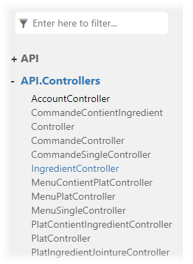

[Abstract [3](#abstract)](#abstract)

[Introduction générale
[4](#introduction-générale)]

[Présentation personnelle
[4](#présentation-personnelle)]

[Présentation formation [4](#_Toc89158458)]

[Préambule [6](#préambule)]

[FoodBook -- Gestion et réservation auprès d'un restaurant
[6](#foodbook-gestion-et-réservation-auprès-dun-restaurant)]

[Expadon2 -- Certificats de vétérinaire pour importation et exportation
alimentaire depuis la France [7](#_Toc89158461)]

[ORIGINES ET OBJECTIF DU PROGRAMME EXPADON 2
[10](#origines-et-objectif-du-programme-expadon-2)]

[SERVICES PRÉVUS DANS EXPADON 2
[10](#services-prévus-dans-expadon-2)]

[CONDUITE DES TRAVAUX ET MISE EN SERVICE
[11](#conduite-des-travaux-et-mise-en-service)]

[Conduite des travaux
[11](#conduite-des-travaux)]

[Chantiers parallèles
[11](#chantiers-parallèles)]

[Information [11](#information)]

[Collaborer à la gestion d'un projet informatique et à l'organisation de
l'environnement de développement
[0](#collaborer-à-la-gestion-dun-projet-informatique-et-à-lorganisation-de-lenvironnement-de-développement)]

[Collaboration [0](#collaboration)]

[Gestion de projet [0](#gestion-de-projet)]

[Environnement de gestion de développement
[1](#environnement-de-gestion-de-développement)]

[Concevoir une application
[6](#concevoir-une-application)]

[Diagramme de cas d'utilisations
[6](#diagramme-de-cas-dutilisations)]

[Dictionnaire des données
[7](#dictionnaire-des-données)]

[Modèle conceptuel de données [8](#_Toc89158475)]

[Diagramme de package
[10](#diagramme-de-package)]

[Diagramme de séquence
[18](#diagramme-de-séquence)]

[Exemple [19](#exemple)]

[Développer des composants métier
[20](#développer-des-composants-métier)]

[Qu'est-ce que des composants métier ?
[20](#quest-ce-que-des-composants-métier)]

[Développer une application mobile
[23](#développer-une-application-mobile)]

[Application native et autres possibilités
[23](#application-native-et-autres-possibilités)]

[D'autres options [24](#dautres-options)]

[Le choix que j'ai pris en relation avec la formation de concepteur
développeur d'applications :
[25](#le-choix-que-jai-pris-en-relation-avec-la-formation-de-concepteur-développeur-dapplications)]

[Nos formateurs nous ont demandé de développer en UWP
[25](#nos-formateurs-nous-ont-demandé-de-développer-en-uwp)]

[UWP ? [25](#uwp)]

[Construire une application organisée en couches
[28](#construire-une-application-organisée-en-couches)]

[Système Multicouche [28](#système-multicouche)]

[Préparer et exécuter les plans de tests d'une application
[30](#préparer-et-exécuter-les-plans-de-tests-dune-application)]

[Test unitaire [30](#test-unitaire)]

[Test d'intégration [32](#test-dintégration)]

[Test contrat [34](#test-contrat)]

[Test end-to-end [35](#test-end-to-end)]

[Test de non-régression
[35](#test-de-non-régression)]

[Préparer et exécuter le déploiement d'une application
[36](#préparer-et-exécuter-le-déploiement-dune-application)]

[Importer le jeu d'essai
[36](#importer-le-jeu-dessai)]

[Paramétrage [36](#paramétrage)]

[Publication en ligne par ftp
[37](#publication-en-ligne-par-ftp)]

[Token JWT [39](#token-jwt)]

[L'application FoodBook en image
[40](#lapplication-foodbook-en-image)]

[L'application mobile [40](#lapplication-mobile)]

[Documenter FoodBook [41](#documenter-foodbook)]

[Documentation de l'API
[41](#documentation-de-lapi)]

[Documentation technique
[42](#documentation-technique)]

[Faire de la veille technologique
[44](#faire-de-la-veille-technologique)]

[Dapper N to N tiers [44](#dapper-n-to-n-tiers)]

[Connexion au tunnel SSH de Capgemini problématique
[46](#connexion-au-tunnel-ssh-de-capgemini-problématique)]

[Java -- requêtes préparées SQL
[47](#java-requêtes-préparées-sql)]

[Conclusion [49](#conclusion)]

# Abstract

FoodBook

The digital company DreamSoftware creates simple software prototypes
hoping to commercialize it in the future.

They would like to propose a software solution for the restaurant
industry by creating a prototype of the FoodBook application.

In order to meet the specification of the brief, I started by modeling
UML (Unified Modeling Language) diagrams and creating a CDM (Conceptual
Data Model) and then a DB (Database) fed by a test set of 43 dishes (6
different dishes per day of the week).

Afterward, I made made the server application with the Restful API
(Application Programming Interface), the BLL (Business Logic Layer), the
DAL (Data Access Layer) while respecting the specifications.

Later, I modeled the desktop application dedicated to the administrator
and developed the application to consume the API.

Then, I developed the model of the UWP (Universal Windows Platform)
mobile application and I programmed it using observables useful for the
different layers: model, view, view-model, and BLLC (Business Logic
Layer Client).

The application is functional and perfectly addresses the needs of the
client. In the future, it could evolve towards a next version and
benefits from a more elaborate UX and UI (user experience and interface)
intended for the future customers of the restaurant.

Keywords: DreamSoftware, prototypes, FoodBook, UML (Unified Modeling
Language), CDM (Conceptual Data Model), DB (Database), API (Application
Programming Interface) Restful, BLL (Business Logic Layer), DAL (Data
Access Layer), UWP (Universal Windows Platform), BLLC (Business Logic
Layer Client), UX and UI (user experience and interface)

# Introduction générale

## Présentation personnelle

Après avoir suivi des études en bac professionnel en Maintenance des
Equipements Industriels (MEI), j'ai obtenu le titre de Technicien
d'Assistance en Informatique (TAI). Afin d'améliorer mes compétences, Je
poursuis mon apprentissage au CRP d'AMiO où j'ai pour objectif d'obtenir
le titre de Concepteur Développeur d'Applications (CDA).

## Présentation formation

La formation CDA vise l'insertion professionnelle dans les métiers du
développement informatique.

Elle vise aussi l'acquisition des gestes professionnels afin de
permettre aux stagiaires de s'intégrer et être opérationnel.

Le parcours s'appuie sur un socle de connaissances et de savoir-faire
fondamentaux pour les développeurs. Le parcours est construit afin de
permettre l'acquisition des compétences professionnelles selon une
progression pédagogique adaptée au public accueilli.

En parallèle des apprentissages, les stagiaires mènent un projet fil
rouge, une mise en situation professionnelle qui les amène à construire
une application en plusieurs étapes. Ce travail vise à consolider les
compétences et sert de support aux Evaluations des Compétences au cours
de la Formation.

Voici une frise chronologique du déroulé de la formation puis un détail
des nombreuses compétences à acquérir. Je ferai un zoom ultérieurement
sur les compétences qui m'ont été utiles à ce projet nommé : Le projet
fil rouge.

Deux Périodes d\'Application en Entreprise permettent de mettre en œuvre
les compétences acquises en formation dans ce nouvel environnement.

La durée totale du parcours est de 91 semaines dont 24 semaines en
Périodes d'Application en Entreprise (PAE).

J'ai effectué un stage intensif avec Fabien Belugou sur Java JEE et
Angular du 11 décembre 2020 au 8 janvier 2021 (vacances non comprises),
puis la première PAE du 11 janvier 2021 au 12 mars 2021 au sein de
Capgemini Mérignac.

Me voici en fin de parcours, après avoir obtenu les deux premiers CCP :

-   CCP1 - Concevoir et développer des composants d\'interface
    utilisateur en intégrant les recommandations de sécurité.

-   CCP2 - Concevoir et développer la persistance des données en
    intégrant les recommandations de sécurité.

Dès lors, il me reste à obtenir le troisième CCP et le titre

-   CCP3 - Concevoir et développer une application multicouche répartie
    en intégrant les recommandations de sécurité

Voici les compétences que j'ai eu l'opportunité de mettre en œuvre dans
ce projet : 

-   Collaborer à la gestion d'un projet informatique et à l'organisation
    de l'environnement de développement

-   Concevoir une application

-   Développer des composants métier

-   Construire une application organisée en couches

-   Développer une application mobile

-   Préparer et exécuter les plans de tests d'une application

-   Préparer et exécuter le déploiement d'une application

# Préambule

Pour couvrir l'ensemble des compétences de l'activité 3, je vais vous
présenter 2 projets que j'ai réalisés : FoodBook et Expadon2.

Le premier projet a été développé seul et le second en équipe au sein de
Capgemini Mérignac.

## FoodBook -- Gestion et réservation auprès d'un restaurant

Pour commencer, le projet qui remplit le plus de compétences est le
« Fil rouge » que AMiO m'a confié, avec son cahier des charges.

Il était stipulé dans ce cahier des charges de développer une
application multi-couche d'un prototype de logiciel en Winforms et
d'application mobile en UWP

(« Universal Windows Platform ou plateforme d\'application universelle
Windows est une architecture homogène créée par Microsoft et introduite
pour la première fois dans Windows 10. L\'objectif de cette plate-forme
logicielle est d\'aider à développer des applications universelles qui
fonctionnent sous Windows 10, Windows 10 Mobile, Xbox One et Hololens
sans qu\'il y ait le besoin de réécrire un nouveau code source pour
chacun de ces systèmes. Il prend en charge le développement
d\'applications Windows en utilisant C++, C#, VB.NET et XAML. L\'API est
implémentée en C++ et prise en charge en C++, VB.NET, C#, F# et
JavaScript. Conçu comme une extension de la plate-forme Windows Runtime
introduite pour la première fois dans Windows Server 2012 et Windows 8,
UWP permet aux développeurs de créer des applications susceptibles
d\'être exécutées sur plusieurs types de périphériques. » Source :
Wikipedia ).


Figure Diagramme de cas d\'utilisations du projet FoodBook

L'ensemble de ce projet doit permettre la gestion d'un restaurant pour
un restaurateur ainsi que la réservation pour un client utilisateur. Le
diagramme de cas d'utilisations peut vous être utile à comprendre
simplement ce que le prototype est capable de faire. Le but étant la
commercialisation de ce projet créé par DreamSoftware (entreprise
fictive).

Ce projet est développé en C# pour le serveur et l'application desktop
du restaurateur et en UWP pour l'application mobile.

 

Au terme de ce projet, l'application est composée d'un serveur dont une
API Restful permettant de gérer des ingrédients, plats, utilisateurs,
menus et de voir la commande d'ingrédients pour la semaine suivante, le
tout protégé par une authentification et autorisation par token JWT.

(« Un JSON Web Token est un access token (jeton d'accès) aux normes RFC
7519 qui permet un échange sécurisé de donnée entre deux parties. Il
contient toutes les informations importantes sur une entité, ce qui rend
la consultation d'une base de données superflue et la session n'a pas
besoin d'être stockée sur le serveur (stateless session).

Les JSON Web Token sont particulièrement appréciés pour les opérations
d'identification. Les messages courts peuvent être chiffrés et
fournissent alors des informations sûres sur l'identité de l'expéditeur
et si celui-ci dispose des droits d'accès requis. Les utilisateurs
eux-mêmes ne sont qu'indirectement en contact avec les token, par
exemple lorsqu'ils entrent un nom d'utilisateur et un mot de passe dans
un masque. La véritable communication se fait entre les différentes
applications du côté serveur et client » Source : https://www.ionos.fr)

L'application mobile permet de réserver un certain plat pour une semaine
choisie, une période ainsi que le type de plat (entrée, plat, dessert).

[]{#_Toc89158461 .anchor}

## Expadon2 -- Certificats de vétérinaire pour importation et exportation alimentaire depuis la France

Ma seconde période d'activité en entreprise qui s'est déroulée du
20/09/2021 au 10/12/2021 m'a permis de travailler avec une équipe de
développeurs, responsables technique et fonctionnels ayant plusieurs
compétences pour mener à bien un projet commun.

Ce projet est développé en Angular pour le front, JavaEE avec SpringBoot
pour le back et PostgreSQL pour les bases de données.


Les applications incluses dans le projet EXPADON 2 sont utiles pour
l'importation et l'exportation de produits alimentaires dans le monde.
C'est un projet pour le Ministère de l'Agriculture et Capgemini est
sous-traitant de France AgriMer. Le projet Expadon 2 permet d'autoriser
les produits à passer les douanes en étant certifiés par des
vétérinaires et inscrits sur le serveur gouvernemental français. Il y a
plusieurs acteurs :

-   Administrateur

-   Demandeur

-   Instructeur

-   Signataire

-   Assistant

-   Douanier

Le projet se compose de plusieurs applications permettant de créer des
utilisateurs et de les gérer, de digitaliser un modèle de certificat, de
gérer ce modèle de certificat, de demander un certificat (pour un rôle
demandeur), d'instruire un certificat (pour un rôle d'instructeur), de
signer un certificat (pour un rôle de signataire) puis d'afficher le
certificat sur un futur serveur gouvernemental, qui n'est pas encore
opérationnel. Ce certificat est automatiquement généré en PDF. Un
douanier pourra autoriser la marchandise à rentrer ou sortir d'un pays,
le tout dans plusieurs langues.

Ce qui est intéressant, c'est de pouvoir aider à l'industrialisation de
ce produit en apportant ma pierre à l'édifice en ajoutant des
fonctionnalités, corrigeant des mantis (bug) et même aidant les membres
de l'équipe à l'optimisation du dossier d'installation de l'application.

Voici un bref aperçu du workflow principal pour un certificat (de la
demande à la signature) :


Voici maintenant un document expliquant le but d'Expadon 2


# ORIGINES ET OBJECTIF DU PROGRAMME EXPADON 2

Le programme Expadon 2 procède du constat que l'efficacité à gérer les
procédures sanitaires et phytosanitaires (SPS) nécessaires à
l'exportation (et notamment la délivrance des certificats SPS)
correspond à un besoin majeur pour accompagner les exportations
françaises et permettre une plus grande fluidité des procédures. Il est
en fait probable que des pays importateurs exigent, à l'avenir, un
dispositif dématérialisé (jugé plus fiable que les échanges de
certificats actuellement en vigueur).

Ce besoin a été identifié tant par les filières professionnelles, qui
l'ont exprimé à plusieurs reprises -- programme stratégique IAA, Comité
Asie que par les pouvoirs publics, dans le cadre de la priorité donnée à
l'exportation. Expadon 2 a donc été érigé comme une priorité du
Ministère de l'Agriculture en constituant l'une des actions prévues par
le Contrat de la filière agroalimentaire pour encourager l'organisation
collective à l'export et faciliter les démarches des entreprises.

En effet, le logiciel actuel, Expadon, créé en 1998, constitue désormais
un outil aux fonctionnalités limitées en termes de télétransmission, de
téléprocédure ou de convivialité : s'il offre une base de données
intéressantes sur les conditions SPS à l'exportation vers les pays tiers
d\'animaux, végétaux et produits agroalimentaires et sur les conditions
d'échange d'animaux vivants dans l'Union européenne ses fonctionnalités
en termes de télétransmission restent restreintes, limitant ainsi la
fluidité des opérations et toute évolution vers la e-certification.
Ainsi ce logiciel ne répond plus aux attentes ni des services, ni des
opérateurs, une situation qui conduirait à terme à une perte de
compétitivité.

Pour répondre à cet enjeu, le programme Expadon 2 a été lancé, avec
l'objectif de fournir un service efficient aux professionnels et aux
services de l'État. Il est doté d'un budget de 7,8 M€, y compris 1,2 M€
pour la première année de fonctionnement.

# SERVICES PRÉVUS DANS EXPADON 2

Cette plateforme fournira sept
fonctionnalités (ou modules) aux exportateurs et aux services
utilisateurs (Direction générale de l'alimentation (DGAL),
FranceAgriMer, Directions régionales de l\'alimentation, de
l\'agriculture et de la forêt (DRAAF), Directions départementales en
charge de la protection des populations (DD(CS)PP), Services économiques
des Ambassades de France à l'étranger, etc.) ainsi qu'une fonctionnalité
dédiée aux importateurs :

**\>** Gestion des demandes d'agréments des établissements à l'export

La gestion (candidature, suivi et instruction de la demande, agrément à
l'exportation) des établissements agréés à l'exportation sera
dématérialisée.

**\>** Délivrance des certificats SPS pour les produits exportés Ce
module permettra de renseigner en ligne les demandes de certificats SPS
pour l'exportation et leur circulation, en mode collaboratif et
dématérialisé, entre les acteurs impliqués. Ainsi, dès accord des pays
tiers dans le cadre de négociations adhoc, la France sera prête à
remettre des certificats totalement dématérialisés aux autorités
sanitaires de ces pays.

Ce service fera l'objet d'une facturation pour permettre le
développement des services Expadon 2, son entretien et son remplacement
in fine.

**\>** Traitement des notifications SPS de l'Organisation Mondiale du
Commerce (OMC)

Les pays tiers notifient via l'OMC les changements de leurs
réglementations sanitaires et phytosanitaires ayant un impact sur le
commerce.

Ce module permettra une circulation plus rapide et mieux ciblée de ces
informations entre les opérateurs, les services concernés et la
Commission européenne, afin de réagir aux changements règlementaires en
regard des intérêts français. **\>** Communication en période de crise

Ce module permettra d'informer les parties concernées en cas de crise
sanitaire, de manière réactive et directe, afin d'éviter au maximum les
blocages aux frontières.

Ce module permettra également de signaler les blocages en frontière du
pays tiers et d'y réagir, ainsi que de recenser et de suivre les
non-conformités.

**\>** Information collaborative sur les dossiers priorisés de
négociation SPS

La feuille de route, établie lors des réunions du comité SPS export
organisées par FranceAgriMer, recense les dossiers priorisés pour la
négociation dans le domaine SPS ; ce module permettra de suivre
l'avancée des négociations, de manière partagée avec les professionnels
et les services.

**\>** Tableaux de bord

Ces tableaux permettront de suivre et de
mesurer l'activité à l'exportation et l'utilisation faite de l'outil
Expadon 2, afin d'améliorer son fonctionnement et le service rendu.

> **\>** Information sur les marchés export, de nature règlementaire,
> économique ou autre
>
> Expadon 2 inclura un outil de stockage et de diffusion d\'informations
> ciblées (par un système d'abonnement et de mots-clés) vers les
> opérateurs concernés, pour renseigner ceux-ci sur les conditions de
> marché et d'exportations. **\>** Information sur les procédures import
>
> Expadon 2 a enfin vocation à reprendre l'outil Impadon qui permet de
> mettre à disposition du grand public des informations relatives aux
> conditions d\'importation des marchandises sanitaires et
> phytosanitaires sur le territoire de l\'Union européenne.
>
> Enfin, un dispositif d'enregistrement des utilisateurs professionnels
> et administratifs sera mis en place pour assurer la connexion au
> service Expadon 2 ; il devra combiner des obligations de sécurité
> (indispensable pour garantir la confidentialité des informations de
> l'entreprise, notamment) à un objectif de facilité et de rapidité pour
> les opérateurs.

# CONDUITE DES TRAVAUX ET MISE EN SERVICE

> Les travaux ont débuté sur le « socle » nécessaire à l'ensemble des
> modules (architecture du programme, référentiels de données, fonctions
> conjointes --connexion, gestion électronique de documents (GED), etc)
> et sur les modules « agrément » et « notification OMC ». Ce choix a
> été retenu pour permettre d'aborder le module « certificats » (le plus
> important mais aussi le plus difficile et le plus sensible) sur une
> base confortée, lorsque la structure du programme aura déjà été
> éprouvée.

## Conduite des travaux

> Les travaux associent les utilisateurs à la conception de l'outil, à
> sa recette et à sa prise en mains. Il est en effet nécessaire que les
> exportateurs et les services chargés des questions SPS soient
> impliqués, dès la conception, pour permettre à cet outil de répondre
> au mieux à leurs besoins et d'être le plus opérationnel possible.
> Ainsi, un groupe utilisateurs a été constitué, en combinant deux
> objectifs :
>
> **\>** représenter la diversité des pratiques qui s'avère grande entre
> les filières (végétal / animal ; viande / lait, etc.) mais aussi, au
> sein de chaque filière ;
>
> **\>** être de taille suffisamment réduite pour rester opérationnel.
> Un dispositif à deux étages a donc été retenu : **\>** une
> participation aux réunions de travail ; une dizaine de représentants
> professionnels participent au groupe de travail, notamment pour les
> modules d'agrément et de certification SPS. Ils ont été choisis de
> manière à refléter la diversité des situations. Ponctuellement, des
> sessions particulières sont organisées sur les questions propres à une
> filière.
>
> **\>** des échanges électroniques ; ces participants assurent la
> concertation pour leur filière, en y associant un nombre plus
> important d'experts qui remontent les propositions et leurs
> commentaires, pour synthèse et examen en groupe utilisateurs ;
>
> Ces groupes ont été mis en place en décembre 2013. S'agissant des
> exportateurs, la sélection des participants a été confiée aux
> fédérations professionnelles.

## Chantiers parallèles

L'un des principaux chantiers à mener, de manière parallèle au
développement de l'outil lui-même, consiste à s'assurer que l'outil
Expadon 2 :

**\>** se développe en phase et de manière compatible avec les efforts
de dématérialisation des procédures SPS en cours : c'est notamment le
cas du programme européen TRACES et des initiatives de dématérialisation
de certificats lancées au niveau international, notamment dans le
domaine phytosanitaire ; ces travaux doivent être suivis et l'interface
avec Expadon 2 doit déjà être prévue ;

**\>** assure la dématérialisation des certificats SPS « de bout en bout
», y compris donc jusqu'aux services SPS des pays tiers ; or, jusqu'à ce
que des solutions reconnues au niveau international soient généralisées
(ce qui prendra plusieurs années), cette reconnaissance passera par des
accords bilatéraux avec les pays tiers, sur la base de solutions
adaptées (et variables) selon les pays, en fonction de leurs attentes et
de leurs moyens. Ces discussions ont été entamées dans le domaine
phytosanitaire ou avec certaines autorités
(Chine, Taïwan, Singapour) mais leur conclusion prendra plusieurs
années.

## Information

Vis-à-vis des professionnels, outre les réunions de travail,
l'information sur le projet et son avancement sera donnée lors de
diverses réunions et notamment :

**\>** lors des comités SPS export tenus à FranceAgriMer ; **\>** lors
des présentations de l'actualité internationale aux conseils spécialisés
ou aux comités de FranceAgriMer (notamment : produits laitiers ; viande
rouge ; viande blanche ; fruits et légumes, coproduits) ;

**\>** lors des réunions avec les filières professionnelles adaptées à
cette présentation, et notamment des comités exports auxquels la MAEI
participe (ANIA, Interfel, Inaporc, FICT, SYNPA, GNIS, etc.).

**\>** au conseil d'administration de FranceAgriMer.

Dans la suite du document, je vais montrer ce que j'ai pu réaliser pour
chacune des compétences du titre.

# Collaborer à la gestion d'un projet informatique et à l'organisation de l'environnement de développement 

## Collaboration

J'ai collaboré avec des stagiaires d'AMiO (Surtout Mohamed El Barkani et
Azzedine Boukhanoufa) ainsi qu'avec Fabien Belugou, formateur technique
d'AMiO.

Les échanges m'ont permis de voir des erreurs avant de m'en rendre
compte par moi-même.

Je n'ai pas eu peur du changement et de poser des questions utiles pour
continuer mon projet.

J'ai aussi collaboré avec l'équipe de Capgemini Mérignac technique et
fonctionnelle. Ils ont pu me montrer comment l'approche Agile est mise
en place et m'ont montré ce qu'il se passait vraiment en comparaison à
la théorie de cette dernière.

J'ai été surpris de voir toute l'aide qui m'était proposée dès le début
de mon stage dans cette entreprise. En plus de la documentation
d'installation du projet en cours de marché, des collaborateurs
n'hésitaient pas à m'appeler et à me guider pour résoudre des bugs ou
orienter mes actions pour réaliser les tâches qui m'étaient confiées.

## Gestion de projet

J'ai opté par la méthodologie Agile car elle m'a été enseignée et elle
est utilisée dans beaucoup d'entreprises dont Capgemini.

Dans la méthodologie Agile il y a trois acteurs principaux. Le « PO »
(Project Owner), les utilisateurs et les développeurs (dont un Scrum
Master permettant de gérer les réunions agiles et de les orienter, je
reviendrai plus tard sur ce sujet).

Le créateur du projet ou produit (Project Owner) a son idée
d'application. Il va avoir des utilisateurs (ou des clients) qui ont des
attentes de cette application. Ces utilisateurs vont donc créer des
« User stories », les besoins du client.

Enfin les développeurs vont s'occuper des US (User Stories) en
programmant des fonctionnalités.

Sans une communication entre ces trois principaux acteurs, cela serait
difficile d'arriver à quelque chose de clair pour eux.

Les développeurs vont donc découper les User Stories en des tâches
courtes. Bien entendu nous ne pouvons pas accepter toutes les US qui
arrivent. Donc suivant la valeur de l'US et le temps qui lui sera
accordée, l'équipe va oui ou non pouvoir l'accepter dans le back log (Un
conteneur d'US en attente de développement).

Une équipe de développement qui peut faire 5 US par semaines ne doit pas
avoir un back log avec 10 US par semaine qui s'accumuleront. C'est
pourquoi le Scrum Master est là et va pouvoir gérer ce que l'on accepte
ou non suivant la qualité de l'US, le temps que passeront les
développeurs dessus et la valeur ajoutée au projet.

### Scrum Master

Les Scrum Master sont les animateurs Scrum, le framework Agile léger qui
met l\'accent sur des itérations limitées dans le temps appelées
sprints\*. En tant qu\'animateurs, les Scrum Masters jouent le rôle de
coachs pour le reste de l\'équipe. Ce sont des « Servant Leader », comme
le dit le Guide Scrum. Les bons Scrum Masters s\'engagent à respecter
les bases et les valeurs Scrum, mais restent flexibles et ouverts aux
possibilités d\'amélioration du workflow (flux de travail) de l\'équipe.

Il est là pour l'autorité, la gestion de l'équipe et ne pas oublier de
suivre la méthodologie du projet.

\*« Avec Scrum, un produit est développé dans une série d\'itérations
appelées sprints, lesquels décomposent les grands projets complexes en
petites tâches. », explique Megan Cook, Group Product Manager pour Jira
Software chez Atlassian.

#### Le Scum Master et ce qu'il doit faire

1.  Stand-ups : animer les stand-ups quotidiens (ou Daily Scrums), si
    nécessaire.

2.  Réunions de planification d\'itération/de sprint : protéger
    l\'équipe contre les engagements excessifs et la dérive des
    objectifs. Aider à l\'estimation et à la création de sous-tâches.

3.  Revues de sprint : participer à la réunion et recueillir le
    feedback.

4.  Rétrospectives : noter les domaines d\'amélioration et les éléments
    d\'action à adopter pour les futurs sprints.

5.  Administration des tableaux : travailler en tant qu\'administrateur
    de tableau Scrum. S\'assurer que les cartes sont à jour et que
    l\'outil Scrum, Jira Software ou autre, fonctionne bien. (Notamment
    la méthodologie Kanban)

6.  Réunions individuelles : rencontrer individuellement les membres de
    l\'équipe et les parties prenantes selon les besoins. Régler les
    désaccords au sein de l\'équipe concernant le processus et les
    styles de travail. Bien que de nombreux experts Scrum soient opposés
    à cette méthode, car ils pensent que ces communications doivent
    avoir lieu pendant les stand-ups, certaines équipes, en particulier
    les nouvelles, préfèrent avoir ces interactions régulières en face à
    face avec des membres spécifiques de l\'équipe. Le Scrum Master peut
    décider que ces interactions individuelles sont cruciales pour le
    développement de l\'équipe et pour apprendre à se connaître.

7.  Services de conseil internes : les Scrum Masters doivent être prêts
    à consulter les membres de l\'équipe et les parties prenantes
    internes sur la meilleure façon de travailler avec l\'équipe Scrum.

8.  Rapports : analyse régulière des graphiques Burndown et d\'autres
    outils de planification de portefeuille pour comprendre ce qui est
    développé et à quelle cadence.

9.  Bloqueurs : le Scrum Master aide l\'équipe en éliminant les
    bloqueurs externes et en gérant les obstacles internes par
    l\'amélioration des processus ou des workflows.

10. Travail prenant : si l\'équipe Scrum ne ronronne pas, c\'est le
    problème du Scrum Master. Cela signifie peut-être qu\'il faut
    réparer les ordinateurs cassés, déplacer les bureaux ou même régler
    le thermostat. Les Scrum Masters devraient être à l\'aise pour faire
    à peu près n\'importe quoi pour aider leur équipe, et ne devraient
    pas rechigner à aller chercher des cafés ou des en-cas si c\'est ce
    dont l\'équipe a vraiment besoin. (source : atlassian.com)

## Environnement de gestion de développement

### Solutions possibles

#### GitHub 

GitHub est un service web d\'hébergement et de gestion de développement
de logiciels, utilisant le logiciel de gestion de versions Git. Ce site
est développé en Ruby on Rails et Erlang par Chris Wanstrath, PJ Hyett
et Tom Preston-Werner. GitHub propose des comptes professionnels
payants, ainsi que des comptes gratuits pour les projets de logiciels
libres. Le site assure également un contrôle d\'accès et des
fonctionnalités destinées à la collaboration comme le suivi des bugs,
les demandes de fonctionnalités, la gestion de tâches et un wiki pour
chaque projet.

GitHub est centré vers l\'aspect social du développement. En plus
d\'offrir l\'hébergement de projets avec Git, le site offre de
nombreuses fonctionnalités habituellement retrouvées sur les réseaux
sociaux comme les flux, la possibilité de suivre des personnes ou des
projets ainsi que des graphes de réseaux pour les dépôts (en anglais
repository). GitHub offre aussi la possibilité de créer un wiki et une
page web pour chaque dépôt. Le site offre aussi un logiciel de suivi de
problèmes (de l\'anglais issue tracking system). GitHub propose aussi
l\'intégration d\'un grand nombre de services externes, tels que
l\'intégration continue, la gestion de versions, badges, chat basés sur
les projets, etc.


Légende GitHub Projects - Desktop Client FoodBook


Légende GitHub - Voir les modifications d\'un commit

#### GitLab

GitLab est un logiciel libre de forge basé sur git proposant les
fonctionnalités de wiki, un système de suivi des bugs, l'intégration
continue et la livraison continue. Développé par GitLab Inc et créé par
Dmitriy Zaporozhets et par Valery Sizov, le logiciel est utilisé par
plusieurs grandes entreprises informatiques, dont IBM, Sony, le centre
de recherche de Jülich, la NASA, Alibaba, Oracle, Invincea, O'Reilly
Media, Leibniz Rechenzentrum, le CERN, European XFEL, la GNOME
Foundation, Boeing, Autodata, SpaceX6, Altares et Capgemini.


Légende GitLab - Commit de mise en place d\'un nouvel environment.dev.ts
sur Angular sur le projet Expadon2 de Capgemini Bordeaux

#### Jira

Jira est un système de suivi de bugs, de gestion des incidents et de
gestion de projets développé par Atlassian et publié pour la première
fois en 2002. Il propose des solutions à la fois à destination des
développeurs et des intervenants non-développeurs (fonctionnels).

C'est un outil permettant de créer des workflow qui permet d\'organiser
le travail d\'une équipe Agile ou de suivre des anomalie


Légende Jira - Capgemini Bordeaux


Légende Tableau Kanban où je participe activement au projet EXPADON2

### Solution choisie

J'ai donc choisi la solution de GitHub, qui est gratuit, pour gérer le
projet Fil Rouge de mon cursus de CDA.

Pour le stage je suis passé sur GitLab et Jira car c'est utilisé par
Capgemini Bordeaux. Solution très efficace pour rester Agile avec la
possibilité de mettre les heures approximatives restantes ainsi que les
points pour « évaluer » la difficulté de la tâche. Après un échange avec
ma formatrice, il semble que Jira génère le BurnDownChart pour montrer
le reste à faire dans le sprint.

# Concevoir une application 

## Diagramme de cas d'utilisations

L'idée, nous cherchons ici à savoir quels sont les acteurs qui vont
interagir avec votre programme, quelles sont les fonctionnalités qui
doivent être exposées aux utilisateurs, et qu'elles doivent être les
sorties du programme exposées aux utilisateurs. Cela permet de mieux
cerner comment le programme doit interagir avec le monde réel et les
utilisateurs, c'est très important, car ce sont les fonctionnalités
exposées dans le use-case qui vont orienter toute la conception. Mais,
qu'est-ce qu'un use-case ?

Un cas d\'utilisation, ou cas d\'usage ( « use-case » en anglais ),
définit en génie logiciel et en ingénierie des systèmes une manière
d\'utiliser un système qui a une valeur ou une utilité pour les acteurs
impliqués. Le cas d\'utilisation correspond à un ensemble d\'actions
réalisées par le système en interaction avec les acteurs en vue d\'une
finalité. L\'ensemble des cas d\'utilisation permet ainsi de décrire les
exigences fonctionnelles d\'un système en adoptant le point de vue et le
langage de l\'utilisateur final.

Le cas d\'utilisation est une technique pour capturer les exigences
d\'un système et servir de fil conducteur à l\'ensemble des activités
nécessaires à sa mise en œuvre. Selon le SWEBOK, ils font partie de la
famille des techniques de collecte d\'exigences à base de scénarios.

Selon Bittner et Spence, « Un cas d\'utilisation (\...) permet de
décrire une séquence d\'événements qui, pris tous ensemble, définissent
un système faisant quelque chose d\'utile »^.^ Le cas d\'utilisation
correspond donc à un ensemble d\'actions réalisées par le système en
interaction avec les acteurs en vue d\'une finalité.

Plusieurs définitions plus précises témoignent de l\'évolution du
concept, partant initialement d\'une compréhension comportementale, pour
arriver à une vision pilotée par les objectifs :

-   En 1999, « Un cas d\'utilisation définit une séquence d\'action,
    avec des variantes, que le système peut réaliser et qui produit un
    résultat observable qui a de la valeur pour un utilisateur
    particulier »

-   En 2001, « Un cas d\'utilisation capture un contrat entre les
    parties prenantes et un système concernant les comportements de
    celui-ci. Un cas d\'utilisation décrit les comportements d\'un
    système sous différentes conditions en réponse à une requête de
    l\'une de ses parties prenantes »

```{=html}
<!-- -->
```
-   En 2011, « Un cas d\'utilisation est l\'ensemble des manières
    d\'utiliser un système pour atteindre un but spécifique pour un
    utilisateur particulier. L\'ensemble de tous les cas d\'utilisation
    indique toutes les façons utiles d\'utiliser un système ».

Les cas d\'utilisation tentent d\'éviter tout jargon technique et
essayent au contraire d\'adopter le langage de l\'utilisateur final ou
de l\'expert du domaine.

Voici un exemple de cas d'utilisation qui m'a permis de débuter la
conception de l'application Foodbook au sein d'AMiO :


On y retrouve les principaux acteurs

-   Le restaurateur peut gérer les menus, les filtrer, visualiser la
    commande des ingrédients ainsi que faire tout ce que le client peut
    faire.

-   Le client, lui, peut lire les menus ainsi que réserver.

## Dictionnaire des données

### Qu'est-ce qu'un dictionnaire des données ?

Un dictionnaire des données est une collection de métadonnées ou de
données de référence nécessaire à la conception d\'une base de données
relationnelle. Il est souvent représenté par un tableau à quatre
colonnes contenant le nom, le code et le type de donnée ainsi que des
commentaires ou les règles de gestion de la donnée.

### Exemple FoodBook d'un dictionnaire de données ainsi qu'un dictionnaire détaillé


Légende Dictionnaire de données

## Modèle conceptuel de données

### Qu'est-ce qu'un modèle conceptuel de données ?

Le modèle conceptuel des données (MCD) a pour but de décrire de façon
formelle les données qui seront utilisées par le système d\'information.
Il s\'agit donc d\'une représentation des données, facilement
compréhensible, permettant de décrire le système d\'information à
l\'aide d\'entités et de associations entre elles.

Les cardinalités permettent de caractériser le lien qui existe entre une
entité et la relation à laquelle elle est reliée. La cardinalité d\'une
relation est composée d\'un couple comportant une borne maximale et une
borne minimale, intervalle dans lequel la cardinalité d\'une entité peut
prendre sa valeur :

-   La borne minimale (généralement 0 ou 1) décrit le nombre minimum de
    fois qu\'une entité peut participer à une relation

-   La borne maximale (généralement 1 ou n) décrit le nombre maximum de
    fois qu\'une entité peut participer à une relation (Par exemple un
    livre est écrit par un auteur, (1), un auteur peut écrire plusieurs
    livres (n)

### Exemple tiré de FoodBook, le fil rouge n°4 de ma formation de CDA.

Dans cet exemple je vous propose une version post-EPCF :


Légende MCD après correction, plus clair

### Voici maintenant le MLD 


Nous remarquons qu'un utilisateur peut bien réserver un menu et un
service en enregistrant la dernière date de réservation et que le menu
peut être lié à un service et un plat. (MenuPossedeServicesEtPlat). Le
Plat est quant à lui lié à l'ingrédient. Avec un DTO je peux donc avoir
toutes les informations nécessaires à la mise en œuvre de l'API.

Cette application est un prototype et est évolutive. Les erreurs m'ont
permis d'aller plus loin dans la réflexion.

## Diagramme de package

### Qu\'est-ce qu\'un diagramme de package ?

Les diagrammes de package (ou diagramme de paquetages) sont des
diagrammes structurels utilisés pour représenter l\'organisation et la
disposition de divers éléments modélisés sous forme de paquetages. Un
paquetage est un regroupement d\'éléments UML apparentés, tels que des
diagrammes, des documents, des classes ou même d\'autres paquetages.
Tous les éléments du diagramme sont imbriqués dans des paquetages, qui
sont eux-mêmes représentés sous forme de dossiers de fichiers et
organisés de manière hiérarchique. Les diagrammes de paquetages sont le
plus souvent utilisés pour donner un aperçu visuel de l\'architecture en
couches d\'un classifieur UML, tel qu\'un système logiciel.

### Avantages d\'un diagramme de package

Des diagrammes de package bien conçus offrent de nombreux avantages aux
personnes souhaitant créer une représentation graphique de leur système
ou projet UML.

-   Ils fournissent une perspective précise de la structure hiérarchique
    des différents éléments UML au sein d\'un système donné. 

-   Ces diagrammes permettent de simplifier les diagrammes de classes
    complexes sous une forme visuelle bien ordonnée.

-   Ils offrent une vue d\'ensemble précieuse pour les projets et
    systèmes de grande ampleur.

-   Les diagrammes de paquetages peuvent être utilisés pour clarifier
    visuellement de nombreux types de projets et systèmes.

-   Ces visuels peuvent être facilement mis à jour au fur et à mesure de
    l\'évolution des systèmes et des projets.

Les éléments qui composent un diagramme de paquetages sont relativement
simples. En effet, ces derniers ne comportent que deux symboles :


Voici un exemple de diagramme de package qui m'a permis de réaliser
l'application serveur de FoodBook, le premier projet dont je vous ai
parlé.

A MODIFIER POUR ENLEVER LES FLECHES API BLL DAL !!!!


J'y ai ajouté des flèches pour permettre de comprendre le sens des
données quand elles sont consommées dans l'API en passant par la BLL
(Business Logic Layer, couche logique métier) puis en allant à la DAL
(Data Acces Layer, couche d'accès aux données), avec le chemin inverse.

Il y a donc l'API avec ses Controllers, la BLL avec ses Services, la DAL
avec le UnitOfWork et les Repository.

Les controllers possèdent des EndPoint où l'on vient se connecter avec
une application tierce comme Postman ou tout autre application utilisant
le protocole http. Le Endpoint de l'API va interroger avec le service
concerné dans la BLL en faisant des pré-action et des post-action en
appelant la DAL, là où elle va pouvoir gérer une transaction, une
requête SQL puis renvoyer le résultat à la BLL puis à l'API avant d'être
sérialisé en JSON dans mon cas pour être envoyée en http à l'application
cliente.

La BO (Business Objects) possède les entités et les DTO (Data transfert
object) sous forme d'objets C#.

Il peut y avoir des objets en lecture seulement, similaire à des vues
SQL, qui peuvent être utiles pour transférer certains objets spécifiques
avec des informations supplémentaires ou seulement les informations dont
nous avons besoin.

Pour plus d'informations sur ces diagrammes, je vous redirige vers les
[annexes 1](#_Annexe_1_–).

Voici des extraits des diagrammes de classe que j'ai réalisés pour le
projet Foodbook

### Exemple dans la partie API/Controllers


Légende Exemple de diagramme de classe des controllers


Légende Exemple de diagramme de classe des controllers

###   

###   

### 

### 

### 

### 

### 

### 

### 

### 

### 

### 

### 

### 

### 

### 

### 

### 

### 

### 

### 

### 

### 

### 

### 

### 

### 

### 

### 

### 

### 

### 

### 

### 

### 

### 

### 

### 

### Exemple dans la partie des services (BLL)


Légende Exemple de diagramme de classe des services de la BLL

### Exemple dans la partie repository (DAL)


Légende Exemple de diagramme de classe des Repository de la partie DAL

## Diagramme de séquence

Un Diagramme de Séquence est une forme de diagramme d'interaction. Les
interactions représentées au fil du temps sont dessinées comme des
connecteurs de message à partir d'une Ligne de Vie. Il est intéressant
de pouvoir montrer les objets qui communiquent avec d'autres objets. Et
quels sont les messages déclencher ces communications. Les diagrammes de
séquence doivent rester simple.

Pour plus d'information sur les diagrammes de séquence je vous redirige
vers les [annexes 2](#annexe-2-diagramme-de-séquence).

Je n'ai pas fait de diagramme de séquence pour l'application Foodbook
mais j'ai eu l'occasion d'en réaliser en tant que TP au sein d'AMiO. Le
but était de détailler la séquence du passage en caisse d'un client :

## Exemple

# Développer des composants métier 

## Qu'est-ce que des composants métier ?

Un objet métier ou Business Object est une abstraction de la réalité qui
décrit les structures de données manipulées par les applications et les
processus métier d\'une entreprise. On les retrouve dans la conception
sous forme de classe en relation avec le métier ciblé de l'application.

Par exemple, pour un restaurant, je pourrai avoir un composant
« Utilisateur » avec les propriétés qu'il faut pour respecter un cahier
des charges. Il y aura donc son identifiant technique, son prénom, son
nom ainsi que toutes les données utiles pour l'application.

Bien entendu, il peut y avoir les plats, ingrédients et même les
réservations qui sont des composants métiers.

Il est pratique d'ajouter un ORM\* ou un micro-ORM\*\* pour faire le
mapping (le lien) entre le l'application et la base de données. Il va de
ce fait pouvoir faire le lien automatiquement, faire le lien entre les
tables et les colonnes de la Base de Données, les classes (entités) et
les attributs de cette classe.

\*Un mapping objet-relationnel (en anglais object-relational mapping ou
ORM) est un type de programme informatique qui se place en interface
entre un programme applicatif et une base de données relationnelle pour
simuler une base de données orientée objet. Ce programme définit des
correspondances entre les schémas de la base de données et les classes
du programme applicatif. On pourrait le désigner par-là, « comme une
couche d\'abstraction entre le monde objet et monde relationnel ». Du
fait de sa fonction, on retrouve ce type de programme dans un grand
nombre de frameworks sous la forme de composant ORM qui a été soit
développé, soit intégré depuis une solution externe.\
ils sont souvent complexes : il faut beaucoup de temps pour vraiment les
maîtriser et comprendre toutes leurs subtilités ;

1.  Ils manquent de transparence : il n\'est pas toujours évident de
    savoir ce qu\'il se passe en coulisses, quelles requêtes sont
    effectivement exécutées sur la base de données, quelles données sont
    conservées en cache, dans quels cas le chargement tardif (lazy
    loading) s\'applique, etc. Quand un bug lié à l\'ORM se produit, il
    est parfois difficile de trouver son origine ;

2.  Leurs performances sont médiocres, comparées à celles qu\'on peut
    obtenir en requêtant directement la base en SQL.

\*\* Le micro-ORM est très léger, il permet de requêter une base de
données en SQL, mais sans les inconvénients associés à cette approche
quand on utilise ADO.NET (Driver SQL) :

1.  Pas besoin de manipuler les objets IDbCommand, IDbDataParameter,
    IDataReader, etc. ;

2.  La matérialisation des entités est automatique : on spécifie
    simplement le type des entités via un paramètre générique de la
    méthode qui effectue la requête ;

3.  Le passage des paramètres d\'une requête se fait de façon très
    simple, en passant un objet dont les noms des propriétés
    correspondent aux noms des paramètres (cet objet peut éventuellement
    être d\'un type anonyme).

 Voici des exemples de diagramme de classe
d'objets métiers utilisés dans le cadre du projet fil rouge.

Il existe aussi des Data Transfert Object
(DTO pouvant servir de transférer des objets qui ne sont pas semblables
à ceux de la BDD. Il peut inclure des propriétés supplémentaires, en
avoir moins, inclure une transformation des données.

Imaginons que je veuille faire une requête me rapportant le nombre
d'inscription par plats présents dans une base de données. L'entité
« Plat » ne suffirait pas et je n'aurai peut-être pas besoin de toutes
ses propriétés. C'est pour cela que je peux créer un DTO qui aurait
cette forme :


Légende DTO : PlatPopularite pour la popularité d\'un plat

Dans ce cas « inscrits » y est ajouté et me servira dans la couche
d'accès aux données (DAL) comme un « COUNT » dans une requête SQL
servant à compter le nombre d'inscrits à un plat.

Voici la requête SQL pour apporter de la
technique à la théorie :

Nous constatons que « inscrits » est un alias de
« COUNT(idUtilisateur) » et va pouvoir, grâce à cette requête de la
ligne 87 à la ligne 92, retourner les plats par popularité.

Maintenant intéressons-nous au « PageSize » et au « Page » ainsi qu'au
« QueryCount ».

J'exécute deux requêtes, une requête qui va me renvoyer des informations
de la base de données et une autre qui va me renvoyer le nombre de
lignes de la réponse.

Dans la première requête « stmt », j'utilise une fonction « OFFSET et
FETCH NEXT » en fonction de la taille de la page et du numéro de page
que j'aurai inséré dans le DTO que je vous montre plus loin. De ce fait,
via cette taille de page indiquée, la requête me renverra seulement les
résultats de la page que je veux en fonction d'une taille de page
définie. Ainsi, la « pagination » est mise en place et fonctionne, me
permettant de ne pas saturer une base de données ou l'application qui
devrait récupérer, garder en mémoire et afficher ces données.


Légende DTO : PageRequest avec le numéro de la page (Page) et la
capacité de la page (PageSize) permettant une pagination

Il existe donc des DTO pouvant servir de « vue » comme avec des tables
SQL et d'autres pouvant servir d'outils pour gérer les requêtes et
fonctionnalités du type de réponse ou de requête.

# Développer une application mobile 

Plus de 48 millions de français utilisent un smartphone de nos jours.
C'est un domaine en constante évolution. Aujourd'hui il y a des
applications pour presque tout faire ; du contrôle de la maison
connectée à la connexion de banque à distance et même aux réservations,
commandes, jeux en ligne et bien plus.

## Application native et autres possibilités 

Les débuts des applications mobiles étaient purement natifs.

Les applications natives sont développées spécifiquement pour un système
d'exploitation défini :

-   IOS chez Apple,

-   Android chez Samsung, HTC, Huawei, Sony, Xiaomi, Wiko, Honor etc\...

-   Windows Phone de Microsoft,

-   BlackBerry OS.

Chaque système d'exploitation à son propre SDK (Software Development
Kit), en français un kit de développement logiciel.

Les deux OS (Operating System), en français systèmes d'exploitation, les
plus utilisés de nos jours sont iOS (iPhone, iPad...) et Android
(développé par Google).

Pour iOS nous avons le langage de programmation Swift (anciennement
Objective C) et pour Android : Java ou Kotlin (Java et XML).

De même Xamarin qui est une plateforme permettant de programmer des
applications multi-plateforme avec .NET et C#.

Et il y a surtout .NET 6 qui sera lancé en novembre 2021 et représente
l\'aboutissement d\'un effort de plusieurs années visant à fournir un
framework multiplateforme à code source libre pour tout ce qui concerne
.NET dans une offre globale unifiée.

Ainsi, .NET 6 complétera cet effort en permettant de créer des
applications pour le bureau, le Web, le cloud, les
[mobiles]{.underline}, les jeux, l\'Internet, l\'intelligence
artificielle et bien d\'autres encore, fonctionnant sous Windows, Linux,
Android, iOS, Mac/Mac Catalyst, Windows Arm64, iOS/tvOS et bien
d\'autres. DotNet le fait en regroupant des composants autrefois
disparates, dont Xamarin (d\'où la fonctionnalité iOS/Android/macOS). «
*Un grand changement dans cette version est l\'intégration complète
d\'Android et d\'iOS dans le cadre des charges de travail existantes de
Xamarin* », a déclaré Lander (Principal Program Manager de .NET Core).

« *Cela nécessite la contrainte évidente d\'intégrer un tas de code, de
systèmes de construction et d\'autres technologies. Il faut aussi
intégrer les blogs, les documents et les échantillons. Nous travaillons
avec l\'équipe Xamarin depuis de nombreuses années, mais nous souhaitons
la bienvenue à tous nos amis Xamarin dans le projet .NET 6. Nous
invitons également les utilisateurs de Xamarin à faire partie de .NET 6
» a-t-il ajouté.*

Cela permettra le développement en WPF, WinForms, UWP, .NET MAUI, Win
UI, Project Reunion, etc.

Vous l'aurez compris, pour revenir au sujet, ce qui sera intéressant
pour une application sera donc .NET 6 qui sera multi-plateforme.


Légende .NET 6 MAUI

## D'autres options

### La web application

L'appli web n'est ni plus ni moins qu'un site web réalisé pour le
support mobile. Il reprend les codes UX des applications natives et
utilise des technologies comme le HTML5 ou le CSS3. Elle est donc
compatible avec tous les navigateurs.

#### Les avantages de la web application

-   Aucun téléchargement ni aucune mise à jour ne sont nécessaires, ce
    qui évite de « polluer » la mémoire de l'appareil.

-   Les applications web mobilisent peu de ressources financières
    puisque leur développement et leur déploiement sont rapides et
    faciles. Elles représentent donc une solution peu onéreuse pour
    atteindre les internautes mobiles.

-   Elles sont également plus ouvertes aux évolutions et ne présentent
    aucun problème de compatibilité avec les systèmes d'exploitation du
    mobile.

### L'application hybride

L'application mobile hybride fonctionne comme une « web app » à la
différence près qu'elle est encapsulée dans une application native, donc
présente sur l'écran du téléphone comme n'importe quelle appli.

#### Les avantages de l'application hybride :

-   Facilité et rapidité de développement,

-   Coûts moins élevés que pour créer une application native en jouant
    sur la mutualisation,

-   Evolutivité de l'application facilitée puisque l'application est
    téléchargée sur le support mobile...

#### Les inconvénients de l'application hybride :

-   Les performances seront inférieures à celles d'une application
    native et notamment sa réactivité,

-   Un besoin de maintenance est à prévoir,

-   Le code est moins optimisé que dans le natif ce qui ne permet pas de
    toucher à une utilisation plus poussée de ses fonctionnalités.

## Le choix que j'ai pris en relation avec la formation de concepteur développeur d'applications :

## Nos formateurs nous ont demandé de développer en UWP 

## UWP ?

Qu'est-ce qu'une application UWP ?

UWP est l'acronyme de Universal Windows Platform. Ce sigle fait
référence à une architecture mise à disposition par Microsoft pour
faciliter le déploiement d'une application sur son écosystème.

L'application sera donc compatible avec des Windows Phone et cela tombe
bien car nous sommes dans la catégorie « Développer une application
mobile » de ce dossier projet.

Plusieurs architectures existent en UWP pour programmer une application.
J'ai utilisé le design pattern (patron de conception) MVVM (Model, View,
ViewModel).

### Qu'est-ce que MVVM

MVVM est un design pattern composée de différentes couches :

La vue (view) est l'interface homme-machine (IHM), elle observe la
vue-modèle (View-Model) et peut recevoir des notifications de cette
dernière. La vue-modèle observe le modèle (Model) et peut lui aussi
recevoir des notifications de celui-ci.

Vous l'aurez compris, si je change quelque chose dans la vue, il peut
être changé jusqu'au modèle et inversement. C'est très pratique pour
faire évoluer l'application sans avoir des dépendances trop fortes qui
nous pousserait à changer tout le programme pour des ajouts ou
suppressions d'éléments dans la vue ou dans le modèle par exemple.


Légende Pattern MVVM

Ainsi, en le couplant à une API via une BLL Client, le modèle n'aura
qu'à appeler la BLL Client pour consommer l'API du serveur en passant
par toutes ses couches. Il y a donc une sécurité accrue car deux
vérifications peuvent être faites, une sur l'application locale, UWP, et
une sur le serveur dans la couche de la BLL serveur.

J'ai utilisé XAML (« XAML est un langage déclaratif développé pour les
besoins des systèmes d\'exploitation de Microsoft, Windows Vista,
Windows 7 et Windows 8 et qui permet la description de données
structurées. Prononcé Xammel, ces initiales correspondent à eXtensible
Application Markup Language. Il s\'agit d\'un dialecte XML. » Source :
Wikipedia) pour programmer l'interface visuelle de l'application de
réservation de restaurant.

Voici le code de la page de connexion :

Nous pouvons remarquer qu'il y a des contrôles avec des balises XAML.
Ligne 26 et 27 les TextBox sont liés (bind) sur une propriété du
vue-modèle de la page de connexion en mode TwoWay.

Le mode TwoWay permet de modifier le texte depuis la vue-modèle pour
qu'il change dans la vue et inversement. Très pratique si je veux que
l'utilisateur n'ai pas à retaper toutes les informations à chaque
lancement de l'application ainsi que le fait de pouvoir envoyer ces
données vers la VM puis le modèle jusqu'à l'API pour l'authentification.

Par exemple pour cette page de connexion de l'utilisateur j'ai fait des
grilles dont voici le code qui définit les lignes et les colonnes :


Légende Grilles XAML : page Login

Et voici l'IHM finale :


Légende Vue login (maquette)

On y voit bien les deux colonnes ainsi que les lignes

# Construire une application organisée en couches 

## Système Multicouche

Comme son nom l\'indique, un système multicouche est un système composé
de plusieurs couches.

Chaque couche possède une fonctionnalité et une responsabilité
spécifique.

Prenons l\'exemple d\'un cadre Modèle-vue-contrôleur : chaque couche
possède ses propres responsabilités. Les modèles contiennent la manière
dont les données doivent être formées, le contrôleur se concentre sur
les actions entrantes et la vue sur les actions sortantes.

Chaque couche est dissociée, mais interagit avec les autres. Dans le
style d\'architecture API REST, le même principe s\'applique. Les
différentes couches de l\'architecture travaillent ensemble pour
construire une hiérarchie qui favorise la création d\'une application
plus évolutive et modulaire.

Un système multicouche permet également d\'encapsuler les systèmes
legacy\* et de déplacer les fonctionnalités les moins couramment
utilisées vers un intermédiaire partagé, tout en protégeant les
composants plus modernes et couramment utilisés.

De plus, le système multicouche vous permet de déplacer librement des
systèmes à l\'intérieur et à l\'extérieur de l'architecture à mesure que
les technologies et les services évoluent, augmentant ainsi la
flexibilité et la longévité, à condition que les différents modules
restent associés de la manière la plus souple possible.

Le système multicouche présente des avantages considérables en matière
de sécurité. Il vous permet de parer les attaques au niveau de la couche
du proxy ou d\'autres couches, empêchant les attaques d\'atteindre
l\'architecture réelle de votre serveur.

L\'utilisation d\'un système multicouche avec un proxy ou la création
d\'un point d\'accès unique vous permet de garder les éléments critiques
et les plus vulnérables de votre architecture derrière un pare-feu,
empêchant ainsi toute interaction directe entre eux et le client. La
sécurité ne repose pas sur une solution unique qui « pare toutes les
attaques », mais sur l\'existence de plusieurs couches.

De plus, certains contrôles de sécurité peuvent échouer ou être
contournés. Ainsi, plus vous mettez en place des mesures de sécurité
dans votre système, plus vous avez de chances de prévenir les attaques
préjudiciables.

\* Un système hérité, système patrimonial ou legacy system en anglais
est un matériel ou un logiciel continuant d\'être utilisé dans une
organisation (entreprise ou administration), alors qu\'il est supplanté
par des systèmes plus modernes. L\'obsolescence de ces systèmes et leur
criticité les rendent difficilement remplaçables sans engendrer des
projets coûteux et risqués.\
(Par exemple, les banques et assurances qui ont informatisé leur
traitement des informations dans les années 1970 ont des applications
qui tournent avec du code hérité souvent en COBOL ou en Fortran. Les
risques pris pour réécrire l\'application dans un autre langage et les
coûts inhérents au changement dissuadent souvent la modernisation du
système voire son remplacement.)

### Agencement des dossiers du serveurs

Voici les différentes couches du projet serveur de FoodBook.


# Préparer et exécuter les plans de tests d'une application 

Il y a cinq types de test les plus connus possible à faire sur une
application.

Cette pyramide montre, de bas en haut, les types de tests utilisés.

-   Test unitaire

-   Test contrat

-   Test d'intégration

-   Test end-to-end

-   Test de non-régression


## Test unitaire

À quoi servent les tests unitaires ?

Les tests unitaires permettent de vérifier le bon fonctionnement d'une
petite partie bien précise (unité ou module) d'une application. Ils
s\'assurent qu\'une méthode exposée à la manipulation par un utilisateur
fonctionne bien de la façon dont elle a été conçue.

Ils sont la base sur laquelle les autres processus de tests (tests
fonctionnels, d'intégration, de régression, de performance...) doivent
être construits pour assurer des fondations solides dans le cadre du
développement d\'une application.

Mike Cohn, l'un des théoriciens pionniers de la méthodologie agile
Scrum, met d'ailleurs les tests unitaires à la base de sa Pyramide des
tests (test pyramid) qui rappelle aux développeurs de construire leurs
tests sur différents niveaux de granularité.

Situé dans la granularité la plus fine, cette typologie est la plus
simple, la plus performante et la moins coûteuse à la fois. Celle-ci
sert à garantir qu'une méthode ou fonction est implémentée telle qui est
attendue, couvrant à la fois les cas nominaux et les cas spéciaux
(edge-case). L'idée c'est de faire trois choses :

-   Couvrir l'ensemble du code, mesurable avec un plugin

-   Tester l'ensemble des possibilités qu'offre cette méthode, notamment
    les pré-conditions dans le cadre de la programmation défensive, les
    cas nominaux, la robustesse, etc.

-   Isoler la fonction à tester de ses dépendances, tels que
    l'invocation d'autre méthodes d'une autre classe, on pourrait pour
    cela utiliser une librairie de mocking ou stubbing, le plus connu
    étant Mockito.

### Exemple par rapport au projet FoodBook


Légende FakeRestaurantService (BLL \"mock\") avec fausse base de données


Légende Méthode \"Modify\" du menu pour test unitaire


Légende test unitaire pour modifier le menu avec Arrange/Act/Asserts


Légende Succès des tests

## Test d'intégration

Ici, il s'agit de tester l'interaction des différents composants entre
eux, plus difficile à mettre en place et à maintenir que les tests
unitaires, le but est de se centrer uniquement sur le cas nominal. Les
cas limites devrait être couverts uniquement dans les tests unitaires,
inutiles de les dupliquer en test d'intégration. Contrairement au test
unitaire, servant à s'assurer si les règles métiers sont bien
respectées, ici, chacun des modules indépendants du logiciel est
assemblé et testé dans l'ensemble.

### Exemple par rapport au projet FoodBook


Légende Test d\'intégration d\'ajout d\'utilisateur sur le endpoint
api/v1/utilisateurs


Légende Test d\'intégration requête par ID d\'un utilisateur

## Test contrat

Typologie de test assez peu répandu, mais d'autant plus puissante et
complémentaire au type de test précédent, celle-ci s'applique dès lors
qu'il y ait des interactions avec un service externe, souvent via des
requêtes REST ou des messages via un middleware (intergiciel).

Le terme "contrat" est une parfaite analogie avec le monde juridique où
deux parties (Ex : employeur/salarié, bailleur/locataire,
fournisseur/client, etc.) ne se faisant pas confiance, se mettent
d'accord sur des clauses afin de limiter le risque de litige, et leur
protection serait assuré s'il y en a.

Or ici, le principe est complètement similaire dans le sens où deux
applications n'ayant aucun air de famille (hétérogène au niveau du
langage, système d'exploitation et environnement) communiquent entre
elles, le contrat est une source de vérité garantissant que les risques
d'erreur de compatibilité soient réduits.

Certains logiciels permettent de générer et lancer ces deux types de
tests (JMeter, Tricentis Tosca, SoapUI...) :

-   Coté serveur (provider test) : vérifiant que l'interface REST est
    implémentée tel que le contrat est décrit,

-   Côté client (stub test) : vérifiant que les clients REST effectuent
    des appels tel que le contrat est décrit,

## Test end-to-end

Situant au sommet de cette pyramide, il s'agit d'un test le plus macro
qu'il soit, c'est-à-dire que le procédé est très proche de ce qu'un
client ou testeur humain aurait fait.

Ici, on prend de la hauteur en lançant une application complète et
opérationnelle, et on automatise le parcours le plus nominal qu'il soit
de bout en bout en effectuant les actions humaines, répondant au besoin
de la majorité d'un utilisateur.

Plusieurs outils permettent ceci, le plus connu étant Selenium.

## Test de non-régression

Les Tests de Non-Régression (TNR) ont pour but de s'assurer que les
modifications et évolutions effectuées par les développeurs lors du
dernier sprint n'ont pas entrainé d'effet de bord, en altérant les
parties du code non modifiées. Ils doivent être lancés à chaque
livraison. Pour améliorer le Return Of Investment (ROI) des tests et
tenir les cadences de livraison ces tests sont automatisés pour
accélérer les phases de tests et concentrer les tests manuels sur le
test des évolutions.

A Capgemini Mérignac, ceux-ci sont effectués par l'équipe dite
« fonctionnelle » et non l'équipe « technique ». Ces tests sont exécutés
manuellement par l'équipe bien que des outils existent pour réaliser ces
tâches.

# Préparer et exécuter le déploiement d'une application 

Une fois qu'une application est construite et testée, il faut la
déployer.

Avant tout, il faut reconfigurer les adresses de la base de données et
importer le jeu d'essai local de SQL server sur le serveur distant.

## Importer le jeu d'essai

Je dois ensuite importer le jeu d'essai sur un serveur OVH (tournant
sous linux mais je n'ai pas plus d'information) mis à disposition par
AMiO.

Comme le serveur n'était pas à jour par rapport à mon serveur local,
j'ai dû modifier quelques parties du script que j'avais extrait et cela
a réussi avec succès l'importation.


Légende Post-importation des tables nécéssaires au bon déroulement du
serveur et de l\'API Rest

## Paramétrage

Une fois cela fait, je n'ai plus qu'à redéfinir les paramètres de
l'application. Les paramètres servant à la connexion à la base de
données et à la connexion de Token JWT.


Légende AppSettings.Json - Rubrique API - Commentaire sur les parties du
développement en local et ligne du dessous pour la production en ligne

## Publication en ligne par ftp

J'ai publié le dossier API de mon application en ligne. Ce dossier ainsi
que toutes les références seront mis en ligne, c'est-à-dire toutes les
couches qui en découlent.


Légende Publication en ligne

Enfin je paramètre les informations du ftp et j'obtiens cette fenêtre
qui m'indique que l'API est publiée.


Légende Publication réussie

Je n'ai plus qu'à tester l'url <http://user05.2isa.org/api/doc> et
<http://user05.2isa.org/doc> pour voir si le serveur est bien en ligne
et que l'API y est intégrée et en cours d'exécution.


Légende DOC et API/DOC sur le serveur 2isa.org

L'API est donc en ligne et peut être utilisée avec l'application desktop
et mobile.

# Token JWT

J'ai mis en place un Token JWT dans ce projet me permettant
une authentification et une autorisation à l'API. Dans mon cas, deux
rôles existent : Admin ou User. 


Un Token JWT possède un HEADER, un PAYLOAD et une VERIFY SIGNATURE. Via
la méthode GenerateJwtToken, je génère un token unique pour un
utilisateur définit. 

On y retrouve les trois différentes parties dont le Payload contenant le
login ainsi que l'idUtilisateur qui sera pratique pour la suite, si je
veux par exemple, créer une réservation. 


# L'application FoodBook en image

Voici l'application desktop en fonctionnement

Légende Application desktop

\


# L'application mobile

{width="2.435064523184602in"
height="3.2246894138232722in"}Voici l'application mobile en
fonctionnement


# Documenter FoodBook

## Documentation de l'API


Via un intergiciel (middleware) nommé Swagger ainsi que la génération
des fichiers XML de chaque dossier du serveur, j'ai pu avoir la
documentation de l'API et j'ai pu aussi l'essayer directement sur une
adresse du serveur « /api/doc ». Ainsi, toute la documentation est faite
pour le serveur, son fonctionnement et ses types de retour.

## Documentation technique

Via DocFX avec, toujours, la génération
des fichiers XML des différentes couches du serveur, cet intergiciel m'a
permis de générer la documentation technique du projet. Très utile pour
aider les pairs à s'y retrouver dans le projet.


On y voit les paramètres ainsi que les types de retour. La description
est en réalité le commentaire lié dans le code de la classe.

# Faire de la veille technologique

La veille technologique est utile pour toujours avoir de nouvelles
compétences, s'informer et pouvoir apporter de la nouveauté dans une
équipe. Elle permet de rester à jour sur des technologies et
problématiques.

## Dapper N to N tiers

Mon problème était de récupérer des données de la BDD (base de données)
en intégrant une liste à un objet. Par exemple un nom de commande avec
la liste des ingrédients.

J'ai cherché par moi-même avec une indication de Fabien et la solution
était de rechercher « Dapper N to N tiers » sur Google et de trouver un
site web en anglais expliquant la méthode.


Légende Mapping avec List sur Dapper (micro-ORM) - Solution trouvée sur
Reddit

Cela a fonctionné, mais je ne l'ai plus utilisé, car je n'avais plus
besoin de créer des commandes, mais juste de la liste des commandes.
C'était très intéressant de savoir ajouter une liste à un objet en
utilisant Dapper.

## Connexion au tunnel SSH de Capgemini problématique

Capgemini Bordeaux possède un serveur où il laisse les développeurs se
connecter en SSH.

Un tunnel SSH est un moyen facile de chiffrer et de tunneler le trafic
réseau pour pouvoir, dans ce cas, accéder aux différentes applications
en développement et être autorisé à les utiliser.

Dès que je suis rentré en stage, tous les développeurs étaient
déconnectés de ce tunnel toutes les deux minutes.

J'ai donc fait une recherche pour trouver une solution pour ne plus
qu'ils soient déconnectés.

J'ai trouvé une source sur le site suivant en tapant simplement le
message d'erreur de l'invite de commande Windows :

<https://superuser.com/questions/522094/how-do-i-resolve-a-ssh-connection-closed-by-remote-host-due-to-inactivity>

Le titre était explicite et m'a permis de trouver une piste.


Légende Titre de la recherche trouvée

Sur ce forum j'ai trouvé une solution en testant ce qu'un utilisateur
avait écrit :


Légende Solution d\'un utilisateur

J'ai donc essayé la seconde solution du « *ssh -o
ServerAliveInterval=30* » avant de mettre l'adresse du serveur SSH de
Capgemini. Cela permettait de garder la connexion au serveur ouverte en
la maintenant toutes les 30 secondes. J'ai attendu environ 1h et je n'ai
pas été déconnecté.

Le lendemain au « stand up meeting » j'ai donné la solution et des
personnes m'ont remercié car ils avaient le problème depuis un certain
temps.

## Java -- requêtes préparées SQL

En Java, C# et d'autre langages on utilise des requêtes préparées.

Pour quelles raisons ? Voici la veille que j'ai effectué et ce que j'ai
trouvé à ce propos.

1.  Elles sont précompilées (une fois), donc plus rapides pour
    l\'exécution répétée de SQL dynamique (où les paramètres changent)

2.  La mise en cache des instructions de base de données améliore les
    performances d\'exécution de la base de données

3.  Les bases de données stockent des caches de plans d\'exécution pour
    des instructions précédemment exécutées. Cela permet au moteur de
    base de données de réutiliser les plans pour les instructions
    précédemment exécutées. Etant donné que PreparedStatement utilise
    des paramètres, chaque fois qu\'il est exécuté, il apparaît comme le
    même code SQL, la base de données peut réutiliser le plan d\'accès
    précédent, ce qui réduit le traitement. Les instructions \"inline\"
    les paramètres dans la chaîne SQL et n\'apparaissent donc pas comme
    le même code SQL dans la base de données, ce qui empêche
    l\'utilisation du cache.

4.  Le protocole de communication binaire signifie moins de bande
    passante et des communications plus rapides vers le serveur de base
    de données

5.  Les instructions préparées sont normalement exécutées via un
    protocole binaire non SQL. Cela signifie que les paquets contiennent
    moins de données, ce qui accélère les communications avec le
    serveur. En règle générale, les opérations réseau sont d\'un ordre
    de grandeur plus rapide que les opérations sur disque, lesquelles
    sont d\'un ordre de grandeur plus rapide que les opérations de
    processeur en mémoire. Par conséquent, toute réduction de la
    quantité de données envoyées sur le réseau aura un effet positif sur
    les performances globales.

6.  [Elles protègent contre l\'injection SQL]{.underline} en échappant
    le texte pour toutes les valeurs de paramètre fournies.

7.  Elles offrent une séparation plus étroite entre le code de requête
    et les valeurs de paramètre (par rapport aux chaînes SQL
    concaténées), améliorant la lisibilité et aidant les responsables de
    code à comprendre rapidement les entrées et les sorties de la
    requête.

> Voici un exemple de requêtes préparées dites
> « Optimistes » :
>
> Nous pouvons constater dans cette requête que l'identifiant technique
> dans la clause « Where » est égale à « :id » ligne 29.
>
> C'est à la ligne 30 que l'on va fixer la valeur de « :id » seulement.
> Aucunes injections n'est possible via cette méthodologie.
>
> C'est aussi possible en C#, voici un
> exemple avec des « \@idUtilisateur » et, ligne 30, l'exécution avec la
> variable :

# Conclusion

Cette formation a été très complexe sur la fin, le rythme était soutenu
et m'a permis de comprendre énormément de choses en si peu de temps.

Je comprends mieux le système multicouche et toutes ses spécificités.

La conception est vraiment très importante dans un projet et il vaut
mieux s'y attarder dès le début d'un projet en faisant des
allers-retours avec des pairs et même des personnes qui ne s'y
connaissent pas en programmation pour avoir une vision extérieure du
projet.

J'ai aussi pu voir ce qu'était le travail du développeur en m'intégrant
pleinement à l'équipe de Capgemini Bordeaux qui me laissait réaliser des
User-stories et résoudre des anomalies, j'ai trouvé cette partie
intéressante car on me faisait confiance et cela changeait des cours et
des travaux pratique. Sans tous les cours, je n'aurai pas été capable de
comprendre l'architecture du projet Expadon 2, je n'aurai pas su me
débrouiller et comprendre ce que j'ai fait.

Aujourd'hui je suis capable de transmettre mes savoirs-faires, notamment
en Agilité et en programmation. Je suis adaptable et je n'hésite pas à
m'intégrer à une équipe rapidement.

L'ambiance y fait beaucoup, j'aime quand les collaborateurs partagent
leurs joies poussant à mieux travailler et être davantage motivé.

Merci à ma mère, Capgemini ainsi que tous les formateurs et personnel
d'AMiO qui sont bienveillants au plus haut point.

Merci à vous le jury de m'avoir lu, en espérant que cela corresponde à
vos attentes et m'apporte le dernier certificat de compétence
professionnel dont j'ai besoin pour continuer ma vie et mes projets.

[]{#_Annexe_1_– .anchor}IMPRIMER HORS DOSSIER

# Annexe 1 -- Diagramme de classe

## Diagramme de classe

Le diagramme de classes montre les blocs de construction de tout système
orienté-objet. Les diagrammes de classes représentent une vue statique
du modèle. Ou une partie du modèle, décrivant ce que les attributs et
les comportements, qu'il a plutôt que de détailler les méthodes pour
atteindre les opérations. Les diagrammes de classes sont les plus utiles
pour illustrer les relations entre les classes et les interfaces.
Généralisations, agrégations et les associations sont tous précieux
reflétant l'héritage, la composition ou l'utilisation, et les connexions
respectivement.

Une classe est un élément qui définit les attributs et les
comportements, qu'un objet est capable de générer. Le comportement est
décrit par les messages possibles, la classe est en mesure de
comprendre, avec les opérations qui sont appropriés pour chaque message.
Les classes peuvent aussi avoir des définitions de contraintes, les
valeurs et les stéréotypes marqués.

### Notation de Class

Les classes sont représentées par des rectangles, qui montrent le nom de
la classe et éventuellement le nom des opérations et attributs. Les
Compartiments sont utilisés pour diviser le nom de la classe, les
attributs et les opérations.\
\
Dans le diagramme au-dessous la classe contient le nom de la classe dans
le compartiment le plus élevé. Les détails de compartiment prochains les
attributs, avec l'attribut \"de centre\" montrant valeurs initiales. Le
compartiment final montre les opérations 'setWidth', 'setLength' et
'setPosition' et leurs paramètres. La notation qui précède l'attribut,
ou nom de l'opération, indique la visibilité de l'élément: si le
symbole + est utilisé, l'attribut, ou de l'exploitation, a un niveau de
visibilité publique; si un - symbole est utilisé, l'attribut, ou de
l'exploitation, est privé. En outre, le symbole \# permet une opération,
ou un attribut, être défini comme protégé, tandis que le symbole \~
indique la visibilité du paquetage.


### Interfaces

Une interface est une spécification de comportement que les réalisateurs
consentent à respecter. Il est un contrat! En réalisant une interface,
les classes sont garantis pour supporter un comportement requis. Qui
permet au système de traiter des éléments non-liés de la même façon --
c'est-à-dire par l'interface commune.


Les interfaces peuvent être dessinés dans un style similaire à une
classe, avec des opérations spécifiées. Comme indiqué ci-dessous. Ils
peuvent également être dessinés comme un cercle sans opérations
explicite et détaillée. Lorsque dessiné comme un cercle, la réalisation
des liens vers le cercle, comme 'forme de notation' sont établis sans
flèches cibles.


### Tableaux

Bien que pas une partie de la base UML, une tableau est un exemple de ce
qui peut être fait avec les stéréotypes. Il est dessiné avec une petite
icône de la tableau dans le coin supérieur droit. Attributs de la table
sont stéréotypés «colonne». La clé primaire dans la plupart des
tableaux, est un ou plusieurs champs, qui forment une combinaison unique
utilisé pour accéder à la tableau. L'opération de clé primaire est
stéréotypée comme «PK». Certains tableaux auront une ou plusieurs clés
étrangères, étant un ou plusieurs champs, qui correspondent ensemble sur
une clé primaire dans une table associée. L'opération de clé étrangère
est stéréotypée comme «FK».


### Associations

Une association implique deux éléments du modèle ont une relation.
D'habitude mis en ouvre comme une variable d'instance dans une classe.
Ce connecteur peut inclure des rôles nommés à chaque fin, cardinalité,
la direction et les contraintes. L'association est le type de relation
général entre des éléments. Depuis plus de deux éléments, un élément de
boîte à outils de représentation de diamant peut être utilisé aussi
bien. Lorsque le code est généré pour les diagrammes de classes.
Association dénommée extrémités deviennent variables d'instance dans la
classe cible. Donc, pour l'exemple ci-dessous, \"playsFor \" va devenir
une variable d'instance dans le \"Player\" classe.


### Généralisations

Une généralisation est utilisé pour indiquer l'héritage. Tiré du
classificateur spécifique à un classificateur général. L'implication de
généraliser ce que la source est hérite des caractéristiques de la
cible. Le diagramme suivant montre une classe parentale généralisant une
classe d'enfant. Implicitement, un objet instancié de la classe de
Cercle aura des attributs 'x_position','y_position' et le rayon et un
affichage de méthode(). Notez que la classe \"Forme\" est abstrait,
représenté par le nom est en italique.


Le diagramme suivant affiche une vue équivalent de la même information.


### Agrégations

Les Agrégations sont utilisées pour décrire les éléments, qui sont
constitués d'éléments plus petits. Les relations d'agrégation sont
représentées par une flèche en forme d'un diamant blanc pointant vers la
cible ou parent classe.\
\
Une forme plus forte de l'agrégation - un agrégat composite - est
représenté par une flèche en forme de diamant noir. Et où on utilise les
composants peuvent être inclus dans un maximum d'une composition à la
fois. Si le parent d'une agrégation composite est supprimé, d'habitude
toutes ses parties sont supprimés avec cela. Cependant une partie peut
être individuellement enlevée d'une composition sans devoir supprimer la
composition entière. Compositions sont, des relations asymétriques
transitives et peuvent être récursives.\
\
Le diagramme suivant illustre la différence entre les agrégation faibles
et forts. Un carnet d'adresses est composé d'une multiplicité de groupes
de contact et des contacts. . Un groupe de contact est un groupement
virtuel de contacts. Un contact peut être inclus dans plus d'un groupe
de contact. Si vous supprimez un carnet d'adresses, tous les contacts et
groupes de contact seront également supprimées. Si vous supprimez un
groupe de contact, aucun contact ne sera supprimé.


### Classes d'association

Une classe d'association est une construction, qui permet une connexion
de l'association d'avoir opérations et les attributs. L'exemple suivant
montre comment allouer un employé à un projet que de simplement faire un
lien simple association entre les deux classes. Le rôle d' employé prend
sur le projet est une entité complexe dans son propre droit. Et contient
des détails qui ne fait pas partie de la classe de l'employé ou d'un
projet. Par exemple, un employé peut travailler sur plusieurs projets en
même temps et ont différents titres d'emploi et des niveaux de sécurité
sur chaque.


### Dépendances

Une dépendance est utilisée pour modéliser un large éventail de
relations de dépendance entre les éléments du modèle. Il devrait
normalement être utilisé au début du processus de conception. Pour
indiquer qu'il y a une sorte de lien entre les deux éléments. Mais il
est trop tôt, pour savoir exactement quelle est la relation. Plus tard
dans le processus de conception, les dépendances seront stéréotypés
(stéréotypes disponibles incluent « instancier », «trace»,
«importation», et d'autres), ou remplacées par un type plus spécifique
du connecteur.

### Traces

La relation de la trace est une spécialisation d'une dépendance, des
éléments de liaison de modèle ou ensembles d'éléments représentant la
même idée à travers les modèles. Traces sont souvent utilisés pour
suivre les exigences et les changements de modèle. Comme les changements
peuvent se produire dans les deux directions. L'ordre de cette
dépendance est généralement ignoré. Les propriétés de la relation
peuvent spécifier la cartographie de trace, mais la trace est d'habitude
bidirectionnelle, informelle et rarement calculable.

### Réalisations

L'objet source met en œuvre ou réalise la destination. Les réalisations
sont utilisées pour exprimer la traçabilité et la perfection dans le
modèle. Un processus commercial ou d'une exigence est réalisé par un ou
plusieurs des cas d'utilisation. Qui sont à leur tour réalisé par
certaines classes, qui à leur tour sont réalisées par un composant, etc.
exigences de la cartographie, des classes, etc. à travers la conception
de votre système, à travers les niveaux de modélisation abstraction,
assure la vision holistique de votre système. Il se souvient et reflète
tous les détails qui contraignent et définissent. Une réalisation est
représentée par une ligne en pointillés avec une pointe solide.


### Emboîtements

Une imbrication exprime un connecteur montrant que l'élément source est
imbriqué dans l'élément de cible. Le diagramme suivant montre la
définition d'une classe interne, bien que dans EA il est plus habituel
de leur montrer par leur position dans la hiérarchie des vues du projet.


# Annexe 2 -- Diagramme de séquence

### Ligne de Vie

Une Ligne de Vie représente un participant dans un diagramme de
séquence. Ligne de Vie aura généralement un rectangle contenant son nom
d'objet. Si son nom est \"soi \", qui indique que la ligne de vie
représente le classificateur, qui possède le diagramme de séquence.


Parfois, un diagramme de séquence aura une Ligne de Vie avec un symbole
de l'élément de l'acteur à sa tête. Ce sera généralement le cas si le
diagramme de séquence appartient à un cas d'utilisation. Frontière,
éléments de commande et des entités à partir de diagrammes de robustesse
peut aussi propres Lignes de Vie.


### Messages

Les messages sont affichés sous forme de flèches. Les messages peuvent
être complet, perdus ou trouvés, synchrone ou asynchrone, appeler ou
signaler. Dans le diagramme suivant, le premier message est un message
synchrone (désigné par la flèche solide) avec un message de retour
implicite. Le deuxième message est asynchrone (dénoté par une pointe de
flèche de la ligne), et le troisième est le message de retour asynchrone
(dénoté par la ligne pointillée).


### Exécution Occurrence

Un rectangle mince couler la bouée de sauvetage désigne l'apparition
d'exécution, ou l'activation d'un centre de contrôle. Dans le diagramme
précédent, il y a trois occurrences d'exécution. Le premier est l'objet
source envoi de deux messages et recevoir deux réponses. Le deuxième est
l'objet cible recevant un message synchrone et un retour d'une réponse.
Et le troisième est l'objet cible recevant un message asynchrone et
retourner une réponse.

### Soi Message

Un message d'auto peut représenter un appel récursif d'une opération. Ou
une méthode appelant une autre méthode appartenant au même objet. Il est
montré que la création d'un centre emboîté de contrôle dans l'occurrence
d'exécution de la ligne de Vie.


### Messages Perdus et Trouvés

Les messages Perdus sont ceux qui sont ou envoyés, mais n'arrivent pas
au destinataire destiné, ou qui va chez un destinataire non montré sur
le diagramme actuel. Trouvé des messages sont ceux qui arrivent d'un
expéditeur inconnu, ou d'un expéditeur non montré sur le diagramme
actuel. Ils sont dénotés allant à ou venant d'un élément de critère.


### Ligne de Vie Début et de Fin

Une Ligne de Vie peut être créée ou détruite lors de l'échelle de temps
représenté par un diagramme de séquence. Dans ce dernier cas, la ligne
de vie est terminée par un symbole d'arrêt, représentée comme une croix.
Dans le premier cas, le symbole au début de la ligne de vie est
représenté à un niveau plus bas sur la page qu'un symbole de l'objet qui
a provoqué la création. Le diagramme suivant montre un objet étant créé
et détruit.


### Durée et Contraintes de temps

Par défaut, un message est affiché comme une ligne horizontale. Depuis
la ligne de vie représente le passage du temps bas de l'écran, lors de
la modélisation d'un système en temps réel, ou même un processus
commercial dans le temps. Il peut être important de considérer la durée
qu'il prend pour exécuter des actions. En fixant une contrainte de durée
pour un message, le message sera affiché comme une ligne oblique.


### Fragments Combinés

Il a été indiqué plus tôt que les diagrammes de séquence ne sont pas
destinés à montrer logique procédurale complexe. Bien que ce soit le
cas. Il y a un certain nombre de mécanismes qui ne permettent pour
ajouter un degré de logique procédurale aux diagrammes. Et qui viennent
sous la rubrique des fragments combinés. Un fragment combiné est une ou
plusieurs séquences de traitement enfermé dans un cadre et exécuté dans
des circonstances spécifiques désignés. Les fragments disponibles sont :

-   Fragments Alternative (notée \"alt\") modèles si \... alors \...
    sinon constructions.

-   Fragment d'Option (notée \"opt\") modèles basculer constructions.

-   Modèles de fragments de rupture une alternative séquence
    d'événements qui est traitée au lieu de la totalité du reste de la
    figure.

-   Fragment parallèle (noté \"par\") modèles traitement simultané.

-   Faible fragment de séquençage (notée \"seq\") renferme un certain
    nombre de séquences pour laquelle tous les messages doivent être
    traités dans un segment précédent avant le segment suivant peut
    commencer, mais qui ne fixe aucun séquençage dans un segment sur les
    messages que don 't partagent une bouée de sauvetage.

-   Fragment de séquençage Strict (notée \"strict\") renferme une série
    de messages qui doivent être traitées dans l'ordre donné.

-   Fragment négatif (noté \"neg\") renferme une série de messages
    invalides.

-   Fragment critique renferme une section critique.

-   Ignorer fragment déclare un message ou d'être sans intérêt si elle
    apparaît dans le contexte actuel.

-   Considérez fragment est en effet le contraire du fragment ignorer :
    tout message non inclus dans le fragment envisager doivent être
    ignorées.

-   Fragment d'assertion (notée \"affirmer\") désigne que toute séquence
    pas montré comme un opérande de l'affirmation est invalide.

-   Fragment boucle renferme une série de messages qui se répètent.

Le diagramme suivant montre un fragment de boucle.


Il y a aussi une occurrence d'interaction, qui est semblable à un
fragment combiné. Une occurrence d'interaction est une référence à un
autre diagramme, qui a le mot \"réf\" dans le coin en haut à gauche du
cadre. Et a le nom du diagramme référencé montré au milieu du cadre.

### Porte

Une porte est un point de connexion d'un message à l'intérieur d'un
fragment avec un message en dehors d'un fragment de connexion. EA montre
une porte comme un petit carré sur un cadre de fragment. Portes de
diagrammes agissent comme des connecteurs de-page pour les diagrammes de
séquence. Elle représente la source de messages entrants ou la cible de
messages sortants. Les deux diagrammes suivants montrent comment ils
pourraient être utilisés dans la pratique. Notez que la porte sur le
diagramme de niveau supérieur est le moment où le message flèche touche
le fragment de référence. Il n'y a aucun besoin de rendre aussi une
forme de boîte.


### Partie de Décomposition

Un objet peut avoir plus d'une ligne de vie venant de lui. Ceci permet
pour les messages inter et intra-objet à afficher sur le même diagramme.


### Invariant/Continuations d'State

Un invariant d'état est une contrainte placée sur une bouée de sauvetage
qui doit être vrai au moment de l'exécution. Elle est indiquée par un
rectangle avec des fins semi-circulaires.


Une suite a la même notation comme un invariant d'state, mais il est
utilisé dans des fragments combinés et peut à travers plus qu'une ligne
de vie.
